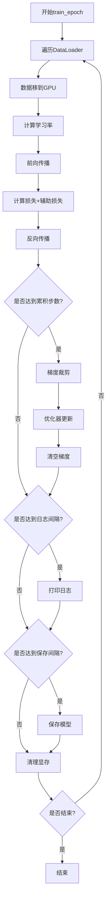

# 01 - MiniMind 全参微调训练程序执行流程概览

## 一、运行指令分析

```bash
CUDA_VISIBLE_DEVICES=2,3 torchrun --nproc_per_node 2 train_full_sft.py \
  --batch_size 16 \
  --epochs 2 \
  --from_weight pretrain \
  --data_path ../dataset/sft_mini_512.jsonl \
  --save_dir ../out \
  --hidden_size 512
```

### 指令组成部分

| 组成部分 | 说明 |
|---------|------|
| `CUDA_VISIBLE_DEVICES=2,3` | 环境变量，指定使用2号和3号GPU |
| `torchrun` | PyTorch 分布式训练启动器 |
| `--nproc_per_node 2` | 每个节点启动2个进程（对应2个GPU） |
| `train_full_sft.py` | 主训练脚本 |
| `--batch_size 16` | 每个GPU的batch size为16 |
| `--epochs 2` | 训练2个epoch |
| `--from_weight pretrain` | 从预训练权重开始 |
| `--data_path` | SFT数据集路径 |
| `--save_dir ../out` | 模型保存目录 |
| `--hidden_size 512` | 模型隐藏层维度 |

## 二、程序入口分析

### 2.1 程序结构

```python
# 文件路径：trainer/train_full_sft.py
├── 导入依赖（Line 1-19）
├── train_epoch() 函数定义（Line 23-82）
└── __main__ 入口（Line 85-166）
    ├── 参数解析（Line 86-108）
    ├── 步骤1：初始化环境（Line 110-113）
    ├── 步骤2：配置模型参数（Line 115-118）
    ├── 步骤3：设置混合精度（Line 120-123）
    ├── 步骤4：配置WandB（Line 125-132）
    ├── 步骤5：定义模型/数据/优化器（Line 134-139）
    ├── 步骤6：从检查点恢复（Line 141-148）
    ├── 步骤7：DDP包装（Line 150-153）
    └── 步骤8：训练循环（Line 155-165）
```

### 2.2 依赖模块

```python
# 标准库
import os, sys, argparse, time, warnings

# PyTorch 核心
import torch
import torch.distributed as dist
from torch import optim, nn
from torch.nn.parallel import DistributedDataParallel
from torch.utils.data import DataLoader, DistributedSampler

# 项目模块
from model.model_minimind import MiniMindConfig           # 模型配置类
from dataset.lm_dataset import SFTDataset                  # SFT数据集
from trainer.trainer_utils import (                        # 训练工具函数
    get_lr,                    # 学习率调度
    Logger,                    # 日志打印
    is_main_process,          # 判断主进程
    lm_checkpoint,            # 检查点管理
    init_distributed_mode,    # 分布式初始化
    setup_seed,               # 随机种子设置
    init_model,               # 模型初始化
    SkipBatchSampler          # 断点续训采样器
)
```

## 三、主程序执行的8个核心步骤（广度概览）

### 步骤1：初始化分布式环境和随机种子

```python
# Line 110-113
local_rank = init_distributed_mode()                                    # 初始化分布式，返回本地rank
if dist.is_initialized(): args.device = f"cuda:{local_rank}"          # 设置设备
setup_seed(42 + (dist.get_rank() if dist.is_initialized() else 0))   # 设置随机种子
```

**核心功能：**
- 初始化分布式通信环境（NCCL后端）
- 设置每个进程的GPU设备
- 为每个进程设置不同的随机种子（确保数据增强多样性）

---

### 步骤2：配置模型参数和检查点

```python
# Line 115-118
os.makedirs(args.save_dir, exist_ok=True)                                    # 创建保存目录
lm_config = MiniMindConfig(                                                   # 创建模型配置
    hidden_size=args.hidden_size, 
    num_hidden_layers=args.num_hidden_layers, 
    use_moe=bool(args.use_moe)
)
ckp_data = lm_checkpoint(lm_config, weight=args.save_weight, 
                         save_dir='../checkpoints') if args.from_resume==1 else None
```

**核心功能：**
- 创建模型配置对象（定义模型架构）
- 检查是否存在可恢复的检查点（断点续训功能）

---

### 步骤3：设置混合精度训练

```python
# Line 120-123
device_type = "cuda" if "cuda" in args.device else "cpu"
dtype = torch.bfloat16 if args.dtype == "bfloat16" else torch.float16
autocast_ctx = nullcontext() if device_type == "cpu" else torch.cuda.amp.autocast(dtype=dtype)
```

**核心功能：**
- 配置自动混合精度（AMP）的数据类型
- 创建 autocast 上下文管理器（加速训练、节省显存）

---

### 步骤4：配置 WandB 日志系统

```python
# Line 125-132
wandb = None
if args.use_wandb and is_main_process():
    import swanlab as wandb
    wandb_id = ckp_data.get('wandb_id') if ckp_data else None
    resume = 'must' if wandb_id else None
    wandb_run_name = f"MiniMind-Full-SFT-Epoch-{args.epochs}-BatchSize-{args.batch_size}-LearningRate-{args.learning_rate}"
    wandb.init(project=args.wandb_project, name=wandb_run_name, id=wandb_id, resume=resume)
```

**核心功能：**
- 仅在主进程初始化日志系统
- 支持断点续训时恢复日志记录

---

### 步骤5：定义模型、数据集、优化器

```python
# Line 134-139
model, tokenizer = init_model(lm_config, args.from_weight, device=args.device)
train_ds = SFTDataset(args.data_path, tokenizer, max_length=args.max_seq_len)
train_sampler = DistributedSampler(train_ds) if dist.is_initialized() else None
scaler = torch.cuda.amp.GradScaler(enabled=(args.dtype == 'float16'))
optimizer = optim.AdamW(model.parameters(), lr=args.learning_rate)
```

**核心功能：**
- 初始化模型（可从预训练权重加载）
- 创建SFT数据集（指令微调格式）
- 创建分布式采样器（确保数据不重复）
- 创建梯度缩放器（混合精度训练必需）
- 创建 AdamW 优化器

---

### 步骤6：从检查点恢复状态

```python
# Line 141-148
start_epoch, start_step = 0, 0
if ckp_data:
    model.load_state_dict(ckp_data['model'])
    optimizer.load_state_dict(ckp_data['optimizer'])
    scaler.load_state_dict(ckp_data['scaler'])
    start_epoch = ckp_data['epoch']
    start_step = ckp_data.get('step', 0)
```

**核心功能：**
- 如果存在检查点，恢复模型权重
- 恢复优化器状态（学习率、动量等）
- 恢复混合精度训练状态
- 恢复训练进度（epoch和step）

---

### 步骤7：分布式数据并行包装

```python
# Line 150-153
if dist.is_initialized():
    model._ddp_params_and_buffers_to_ignore = {"freqs_cos", "freqs_sin"}
    model = DistributedDataParallel(model, device_ids=[local_rank])
```

**核心功能：**
- 使用 DDP 包装模型（多GPU训练核心）
- 忽略旋转位置编码参数（RoPE，无需同步）

---

### 步骤8：开始训练循环

```python
# Line 155-165
for epoch in range(start_epoch, args.epochs):
    train_sampler and train_sampler.set_epoch(epoch)
    if epoch == start_epoch and start_step > 0:  # 断点续训逻辑
        batch_sampler = SkipBatchSampler(train_sampler or range(len(train_ds)), 
                                         args.batch_size, start_step + 1)
        loader = DataLoader(train_ds, batch_sampler=batch_sampler, 
                           num_workers=args.num_workers, pin_memory=True)
        train_epoch(epoch, loader, len(loader) + start_step + 1, start_step, wandb)
    else:  # 正常训练
        loader = DataLoader(train_ds, batch_size=args.batch_size, 
                           shuffle=(train_sampler is None), sampler=train_sampler, 
                           num_workers=args.num_workers, pin_memory=True)
        train_epoch(epoch, loader, len(loader), 0, wandb)
```

**核心功能：**
- 遍历每个 epoch
- 设置采样器的 epoch（确保每个epoch的shuffle不同）
- 断点续训时跳过已训练的batch
- 调用 `train_epoch()` 执行具体训练逻辑

## 四、train_epoch() 函数核心流程



## 五、关键技术点总结

### 5.1 分布式训练
- **DDP（DistributedDataParallel）**: 数据并行训练
- **DistributedSampler**: 确保每个进程处理不同数据
- **torchrun**: PyTorch 官方分布式启动器

### 5.2 混合精度训练
- **autocast**: 自动选择精度（降低显存、加速）
- **GradScaler**: 梯度缩放（防止下溢）
- **支持 bfloat16 和 float16**

### 5.3 训练优化技术
- **梯度累积**: 模拟更大的 batch size
- **梯度裁剪**: 防止梯度爆炸
- **Cosine 学习率调度**: 平滑降低学习率

### 5.4 断点续训
- **检查点保存**: 模型、优化器、scaler、epoch、step
- **WandB ID保存**: 恢复日志记录
- **SkipBatchSampler**: 跳过已训练的batch

## 六、下一步学习内容

在下一节中，我们将深入分析：

1. **分布式环境初始化详解**（`init_distributed_mode()` 函数）
2. **随机种子设置原理**（为什么要 `42 + rank`）
3. **分布式通信机制**（NCCL后端原理）

---

**状态：** ✅ 已完成广度概览，等待反馈后进入深度分析
