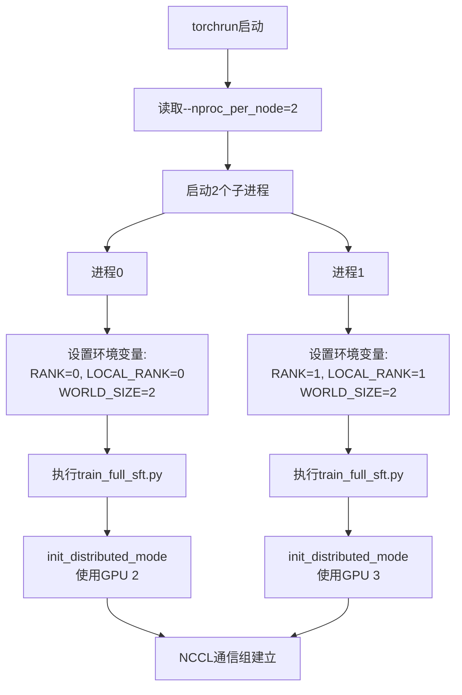
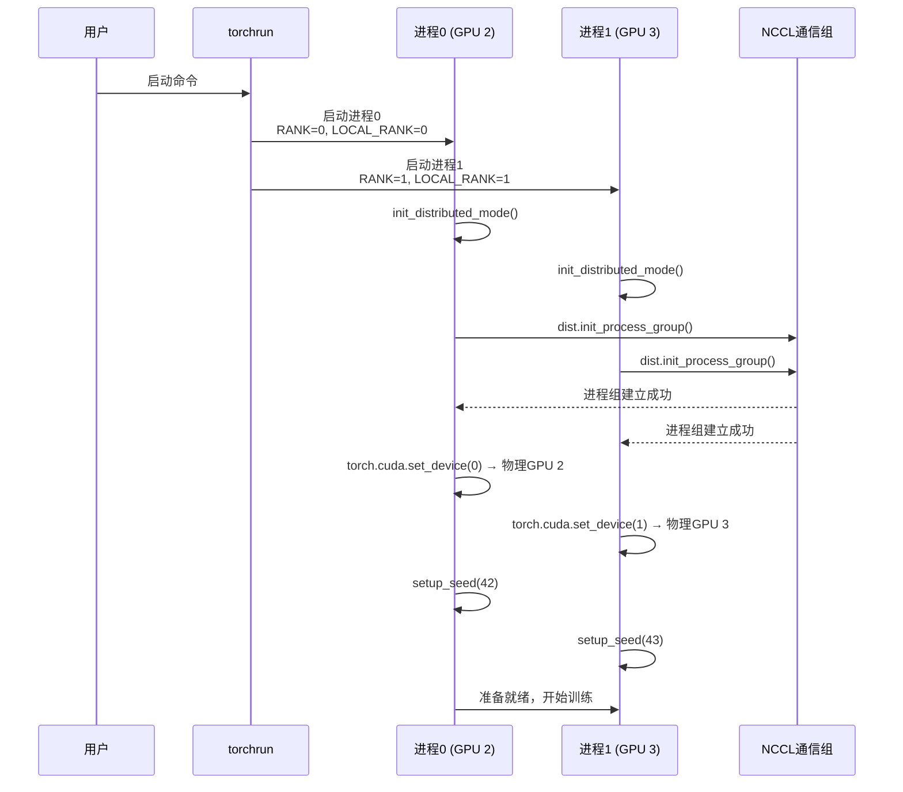

# 02 - 分布式环境初始化与随机种子设置（深度分析）

## 一、模块概述

在 `train_full_sft.py` 的第110-113行，程序执行的第一步就是初始化分布式环境和随机种子：

```python
# Line 110-113
local_rank = init_distributed_mode()  ## 初始化分布式，返回本地rank
if dist.is_initialized(): args.device = f"cuda:{local_rank}"
setup_seed(42 + (dist.get_rank() if dist.is_initialized() else 0))  ## 设置随机种子
```

**为什么这是第一步？**
1. **分布式环境必须最先初始化**：后续所有操作（模型加载、数据分片、梯度同步）都依赖分布式环境
2. **随机种子影响全局**：必须在创建模型、数据集之前设置，确保可复现性

---

## 二、init_distributed_mode() 深度解析

### 2.1 函数源码

```python
# 文件：trainer/trainer_utils.py, Line 29-36
def init_distributed_mode():
    if int(os.environ.get("RANK", -1)) == -1:
        return 0  # 非DDP模式
    
    dist.init_process_group(backend="nccl")
    local_rank = int(os.environ["LOCAL_RANK"])
    torch.cuda.set_device(local_rank)
    return local_rank
```

### 2.2 逐行解析

#### 第1行：检查是否为分布式模式

```python
if int(os.environ.get("RANK", -1)) == -1:
    return 0  # 非DDP模式
```

**关键环境变量：RANK**
- **RANK**：当前进程在所有节点中的全局编号（0, 1, 2, ...）
- 由 `torchrun` 自动设置
- 如果不存在，说明是单GPU或CPU训练，直接返回0

**示例：**
```bash
# 运行指令：torchrun --nproc_per_node 2 train_full_sft.py
# GPU 0: RANK=0, LOCAL_RANK=0
# GPU 1: RANK=1, LOCAL_RANK=1
```

---

#### 第2行：初始化进程组

```python
dist.init_process_group(backend="nccl")
```

**核心概念：进程组（Process Group）**
- 所有参与分布式训练的进程的集合
- 用于进程间通信（梯度同步、all_reduce等）

**NCCL 后端详解：**

| 特性 | 说明 |
|-----|------|
| **全称** | NVIDIA Collective Communications Library |
| **适用场景** | GPU分布式训练（单机多卡、多机多卡） |
| **优势** | 针对GPU优化，通信效率极高（支持NVLink、InfiniBand） |
| **通信原语** | all_reduce, broadcast, all_gather, reduce_scatter |

**自动读取的环境变量：**
- `RANK`：全局进程编号
- `WORLD_SIZE`：总进程数
- `MASTER_ADDR`：主节点地址（多机训练时需要）
- `MASTER_PORT`：主节点端口

---

#### 第3-4行：设置本地设备

```python
local_rank = int(os.environ["LOCAL_RANK"])
torch.cuda.set_device(local_rank)
```

**关键概念：LOCAL_RANK vs RANK**

| 变量 | 范围 | 含义 |
|------|------|------|
| **RANK** | 全局 | 所有节点中的进程编号（0 ~ WORLD_SIZE-1） |
| **LOCAL_RANK** | 节点内 | 当前节点的GPU编号（0 ~ GPUs_per_node-1） |
| **WORLD_SIZE** | 全局 | 总进程数 |

**示例：2台服务器，每台4个GPU**

| 服务器 | GPU | LOCAL_RANK | RANK |
|--------|-----|------------|------|
| Node 0 | GPU 0 | 0 | 0 |
| Node 0 | GPU 1 | 1 | 1 |
| Node 0 | GPU 2 | 2 | 2 |
| Node 0 | GPU 3 | 3 | 3 |
| Node 1 | GPU 0 | 0 | 4 |
| Node 1 | GPU 1 | 1 | 5 |
| Node 1 | GPU 2 | 2 | 6 |
| Node 1 | GPU 3 | 3 | 7 |

**`torch.cuda.set_device()` 的作用：**
- 设置当前进程的默认CUDA设备
- 后续所有 `.to('cuda')` 操作都会自动使用这个设备
- **关键**：避免多个进程竞争同一个GPU

---

### 2.3 torchrun 启动机制

#### 运行指令回顾

```bash
CUDA_VISIBLE_DEVICES=2,3 torchrun --nproc_per_node 2 train_full_sft.py --batch_size 16
```

#### torchrun 的工作流程



**CUDA_VISIBLE_DEVICES=2,3 的作用：**
- 将物理GPU 2和3映射为逻辑GPU 0和1
- 进程看到的设备号：0, 1（实际使用的是物理GPU 2, 3）

---

## 三、setup_seed() 深度解析

### 3.1 函数源码

```python
# 文件：trainer/trainer_utils.py, Line 39-46
def setup_seed(seed: int):
    random.seed(seed)                      # Python随机数
    np.random.seed(seed)                   # NumPy随机数
    torch.manual_seed(seed)                # PyTorch CPU随机数
    torch.cuda.manual_seed(seed)           # 当前GPU随机数
    torch.cuda.manual_seed_all(seed)       # 所有GPU随机数
    torch.backends.cudnn.deterministic = True   # 禁用非确定性算法
    torch.backends.cudnn.benchmark = False      # 禁用自动调优
```

### 3.2 为什么需要设置这么多随机种子？

| 随机源 | 使用场景 | 示例 |
|--------|---------|------|
| `random.seed()` | Python标准库的随机操作 | `random.shuffle()`, `random.choice()` |
| `np.random.seed()` | NumPy数组操作 | `np.random.permutation()`, 数据增强 |
| `torch.manual_seed()` | PyTorch CPU操作 | 权重初始化、Dropout |
| `torch.cuda.manual_seed()` | 当前GPU | CUDA随机数生成 |
| `torch.cuda.manual_seed_all()` | 所有可见GPU | 多GPU环境 |

### 3.3 关键参数详解

#### cudnn.deterministic = True

**cuDNN（CUDA Deep Neural Network library）**
- NVIDIA提供的深度学习加速库
- 提供卷积、池化、激活函数的高效实现

**问题：cuDNN的非确定性**
- 为了性能，cuDNN会使用一些非确定性算法（例如某些卷积实现）
- 相同输入可能产生略微不同的输出（精度差异在1e-5级别）

**`deterministic=True` 的作用：**
- 强制使用确定性算法
- **代价**：性能下降5-10%
- **收益**：完全可复现的结果

---

#### cudnn.benchmark = False

**cuDNN Benchmark 机制：**
- 在训练开始时，cuDNN会测试多种算法，选择最快的
- 如果输入形状固定，这个优化非常有效

**为什么要关闭？**
- Benchmark过程本身包含随机性
- 不同运行可能选择不同的算法
- 关闭后牺牲少量性能，换取可复现性

**性能对比：**
```python
# benchmark=True:  首次运行慢（测试算法），后续快
# benchmark=False: 每次运行速度一致，但不是最优
```

---

### 3.4 为什么随机种子是 42 + rank？

#### 源码回顾

```python
setup_seed(42 + (dist.get_rank() if dist.is_initialized() else 0))
```

#### 原因分析

**1. 为什么不是所有进程用同样的种子？**

假设所有进程都用 `seed=42`：

```python
# 错误示例：所有进程用相同种子
# 进程0: setup_seed(42)
# 进程1: setup_seed(42)

# 数据集shuffle结果完全相同！
# 进程0处理：[样本0, 样本1, 样本2, ...]
# 进程1处理：[样本0, 样本1, 样本2, ...]  ❌ 数据重复！
```

**2. 为什么是 42 + rank？**

```python
# 正确做法：每个进程不同的种子
# 进程0: setup_seed(42 + 0 = 42)
# 进程1: setup_seed(42 + 1 = 43)

# DistributedSampler内部使用种子控制shuffle
# 进程0处理：[样本0, 样本2, 样本4, ...]
# 进程1处理：[样本1, 样本3, 样本5, ...]  ✅ 数据不重复！
```

**3. 为什么基础值选择42？**
- 机器学习社区的约定俗成（源自《银河系漫游指南》）
- 任何固定值都可以，关键是可复现

---

### 3.5 DistributedSampler 与随机种子的关系

```python
# 在 train_full_sft.py 的 Line 137
train_sampler = DistributedSampler(train_ds) if dist.is_initialized() else None
```

**DistributedSampler 的工作原理：**

```python
# DistributedSampler 内部逻辑（简化版）
class DistributedSampler:
    def __init__(self, dataset):
        self.dataset = dataset
        self.rank = dist.get_rank()
        self.world_size = dist.get_world_size()
        self.epoch = 0
    
    def set_epoch(self, epoch):
        self.epoch = epoch  # 每个epoch更新
    
    def __iter__(self):
        # 使用 epoch 作为种子，确保每个epoch的shuffle不同
        g = torch.Generator()
        g.manual_seed(self.epoch)
        
        # 生成全局shuffle索引
        indices = torch.randperm(len(self.dataset), generator=g).tolist()
        
        # 每个进程只取属于自己的部分
        indices = indices[self.rank::self.world_size]
        return iter(indices)
```

**关键点：**
1. 所有进程使用相同的 `epoch` 作为种子 → 生成相同的shuffle顺序
2. 每个进程取不同的分片 → 确保数据不重复
3. 每个epoch调用 `set_epoch(epoch)` → 每个epoch的shuffle不同

---

## 四、完整执行流程示例

### 4.1 单机双卡训练流程

```bash
# 1. 用户执行命令
CUDA_VISIBLE_DEVICES=2,3 torchrun --nproc_per_node 2 train_full_sft.py
```



### 4.2 环境变量实例

**进程0的环境变量：**
```bash
RANK=0
LOCAL_RANK=0
WORLD_SIZE=2
MASTER_ADDR=localhost
MASTER_PORT=29500
CUDA_VISIBLE_DEVICES=2,3
```

**进程1的环境变量：**
```bash
RANK=1
LOCAL_RANK=1
WORLD_SIZE=2
MASTER_ADDR=localhost
MASTER_PORT=29500
CUDA_VISIBLE_DEVICES=2,3
```

---

## 五、常见问题与调试技巧

### Q1: 为什么我的多卡训练只用了一张卡？

**可能原因：**
1. 没有用 `torchrun` 启动，直接用 `python train_full_sft.py`
2. `--nproc_per_node` 设置错误
3. `CUDA_VISIBLE_DEVICES` 只指定了一个GPU

**检查方法：**
```python
print(f"RANK={dist.get_rank()}, WORLD_SIZE={dist.get_world_size()}")
```

---

### Q2: 如何验证随机种子设置成功？

**测试代码：**
```python
import torch
from trainer.trainer_utils import setup_seed

setup_seed(42)
a = torch.randn(3)
print(a)  # 每次运行都应该输出相同的值

# 输出示例（固定）：
# tensor([ 0.3367,  0.1288,  0.2345])
```

---

### Q3: NCCL 初始化失败怎么办？

**错误信息：**
```
RuntimeError: NCCL error in: /pytorch/torch/lib/c10d/ProcessGroupNCCL.cpp
```

**解决方案：**
1. 检查CUDA版本与PyTorch版本匹配
2. 检查NCCL库是否正确安装
3. 设置环境变量：`export NCCL_DEBUG=INFO` 查看详细日志

---

## 六、知识点总结

### 核心概念

| 概念 | 说明 |
|------|------|
| **DDP** | DistributedDataParallel，PyTorch分布式训练核心机制 |
| **NCCL** | NVIDIA GPU通信库，支持高效梯度同步 |
| **RANK** | 全局进程编号（0 ~ WORLD_SIZE-1） |
| **LOCAL_RANK** | 节点内GPU编号（0 ~ GPUs_per_node-1） |
| **WORLD_SIZE** | 总进程数 |
| **DistributedSampler** | 分布式数据采样器，确保数据不重复 |

### 关键代码

```python
# 1. 初始化分布式环境
local_rank = init_distributed_mode()
if dist.is_initialized():
    args.device = f"cuda:{local_rank}"

# 2. 设置随机种子（每个进程不同）
setup_seed(42 + (dist.get_rank() if dist.is_initialized() else 0))
```

---

## 七、下一步学习内容

在下一节中，我们将深入分析：

1. **模型配置与检查点机制**（`MiniMindConfig` 和 `lm_checkpoint()`）
2. **断点续训的完整流程**
3. **检查点文件的内容结构**

---

**状态：** ✅ 已完成深度分析，等待反馈后继续
