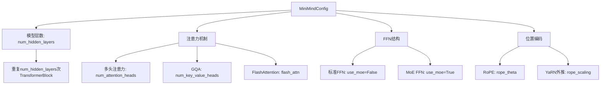

# 03 - 模型配置 MiniMindConfig 详解

## 一、模块概述

在 `train_full_sft.py` 的第115-118行，程序创建了模型配置对象：

```python
# Line 115-118
os.makedirs(args.save_dir, exist_ok=True)  ## 创建保存目录
## 创建模型配置
lm_config = MiniMindConfig(
    hidden_size=args.hidden_size, 
    num_hidden_layers=args.num_hidden_layers, 
    use_moe=bool(args.use_moe)
)
## 检查是否存在可恢复的检查点（断点续训功能）
ckp_data = lm_checkpoint(lm_config, weight=args.save_weight, 
                         save_dir='../checkpoints') if args.from_resume==1 else None
```

**核心作用：**
- **MiniMindConfig**：定义模型的架构参数（层数、维度、注意力头等）
- **lm_checkpoint()**：管理检查点的保存和加载（断点续训的核心）

本文将深入分析 **MiniMindConfig** 配置类。

---

## 二、MiniMindConfig 类的继承关系

### 2.1 类定义

```python
# 文件：model/model_minimind.py, Line 8-10
from transformers import PretrainedConfig

class MiniMindConfig(PretrainedConfig):
    model_type = "minimind"
```

**为什么继承 `PretrainedConfig`？**

| 优势 | 说明 |
|------|------|
| **兼容HuggingFace生态** | 可以使用 `save_pretrained()` 和 `from_pretrained()` |
| **自动序列化** | 配置可以保存为 `config.json`，方便分享和复现 |
| **类型验证** | 自动处理参数的类型转换和验证 |
| **版本管理** | 支持配置版本追踪和迁移 |

---

## 三、MiniMindConfig 参数详解

### 3.1 参数分类

MiniMindConfig 的参数可以分为4类：
1. **基础参数**：通用的模型配置
2. **Transformer架构参数**：注意力机制、层数等
3. **位置编码参数**：RoPE相关配置
4. **MoE（混合专家）参数**：可选的MoE架构配置

---

### 3.2 基础参数

```python
def __init__(
    self,
    dropout: float = 0.0,
    bos_token_id: int = 1,
    eos_token_id: int = 2,
    hidden_act: str = 'silu',
    vocab_size: int = 6400,
    ...
):
```

#### 参数详解

| 参数 | 默认值 | 说明 |
|------|--------|------|
| **dropout** | 0.0 | Dropout比例（0表示不使用Dropout） |
| **bos_token_id** | 1 | Begin-of-Sequence token ID |
| **eos_token_id** | 2 | End-of-Sequence token ID |
| **hidden_act** | 'silu' | 激活函数类型 |
| **vocab_size** | 6400 | 词表大小 |

#### 激活函数选择：SiLU

**SiLU（Sigmoid Linear Unit）公式：**
```
SiLU(x) = x * sigmoid(x) = x / (1 + e^(-x))
```

**为什么选择SiLU？**
- **平滑性**：比ReLU更平滑，梯度更稳定
- **非单调性**：允许负值输出（但有上界）
- **性能**：在现代Transformer中表现优于ReLU
- **LLaMA采用**：与LLaMA、Mistral等主流模型一致

**常见激活函数对比：**

```python
# ReLU:  max(0, x)
# GELU:  x * Φ(x)  (Φ是标准正态分布的CDF)
# SiLU:  x * sigmoid(x)
```

---

### 3.3 Transformer 架构参数

```python
hidden_size: int = 512,
intermediate_size: int = None,
num_attention_heads: int = 8,
num_hidden_layers: int = 8,
num_key_value_heads: int = 2,
max_position_embeddings: int = 32768,
rms_norm_eps: float = 1e-05,
```

#### 参数详解

| 参数 | 默认值 | 说明 | 示例计算 |
|------|--------|------|---------|
| **hidden_size** | 512 | 隐藏层维度（d_model） | 每个token的向量维度 |
| **intermediate_size** | None | FFN中间层维度 | 默认为 `hidden_size * 8/3` ≈ 1365 |
| **num_attention_heads** | 8 | 多头注意力的头数 | 每个头维度 = 512/8 = 64 |
| **num_hidden_layers** | 8 | Transformer层数 | 模型深度 |
| **num_key_value_heads** | 2 | KV缓存的头数（GQA） | 8个Q头共享2个KV头 |
| **max_position_embeddings** | 32768 | 最大序列长度 | 支持32K上下文 |
| **rms_norm_eps** | 1e-05 | RMSNorm的稳定性参数 | 防止除零 |

---

#### 核心技术1：GQA（Grouped-Query Attention）

**什么是GQA？**

传统MHA（Multi-Head Attention）：每个头都有独立的Q、K、V
```
Q heads: 8
K heads: 8
V heads: 8
```

**GQA（Grouped-Query Attention）**：多个Q头共享一组KV头
```
Q heads: 8
K heads: 2  ← 减少KV头
V heads: 2
```

**参数量对比（以hidden_size=512为例）：**

| 架构 | Q参数 | K参数 | V参数 | 总参数 | 节省比例 |
|------|-------|-------|-------|--------|---------|
| **MHA** | 512×512 | 512×512 | 512×512 | 786K | - |
| **GQA** | 512×512 | 512×128 | 512×128 | 393K | **50%** |

**内存占用对比（推理时）：**
```python
# MHA KV缓存: [batch, seq_len, 8_heads, 64_dim] × 2 (K和V)
# GQA KV缓存: [batch, seq_len, 2_heads, 64_dim] × 2 (K和V)
# 内存节省：75% （8头降为2头）
```

**实际使用场景：**
- **训练**：参数量减少 → 训练更快
- **推理**：KV缓存减少75% → 长文本生成能力大幅提升（如32K上下文）

---

#### 核心技术2：RMSNorm

**传统LayerNorm公式：**
```
LayerNorm(x) = (x - mean(x)) / sqrt(var(x) + eps) * γ + β
```

**RMSNorm（Root Mean Square Normalization）公式：**
```
RMSNorm(x) = x / RMS(x) * γ
其中 RMS(x) = sqrt(mean(x^2) + eps)
```

**简化点：**
1. **去除均值计算**：不减去mean
2. **去除偏置项β**：只保留缩放参数γ

**优势：**
- **计算更快**：减少了均值计算和减法操作
- **参数更少**：去掉了β参数
- **效果相当**：在LLM中与LayerNorm性能相当

**源码实现（model/model_minimind.py, Line 96-106）：**

```python
class RMSNorm(nn.Module):
    def __init__(self, dim: int, eps: float = 1e-5):
        super().__init__()
        self.eps = eps
        self.weight = nn.Parameter(torch.ones(dim))  # γ参数
    
    def _norm(self, x):
        return x * torch.rsqrt(x.pow(2).mean(-1, keepdim=True) + self.eps)
    
    def forward(self, x):
        output = self._norm(x.float()).type_as(x)
        return output * self.weight
```

---

#### 核心技术3：FFN中间层维度计算

```python
if config.intermediate_size is None:
    intermediate_size = int(config.hidden_size * 8 / 3)
```

**为什么是 8/3？**

| 因子 | 中间层维度 | 来源 |
|------|-----------|------|
| **4** | 512 × 4 = 2048 | 传统Transformer（BERT、GPT-2） |
| **8/3** | 512 × 8/3 ≈ 1365 | LLaMA、Mistral等现代LLM |
| **3.5** | 512 × 3.5 = 1792 | 一些优化变体 |

**LLaMA的FFN结构：**

```python
class FeedForward(nn.Module):
    def __init__(self, config):
        super().__init__()
        hidden_size = config.hidden_size
        intermediate_size = int(hidden_size * 8 / 3)
        
        # SwiGLU结构（3个线性层）
        self.gate_proj = nn.Linear(hidden_size, intermediate_size, bias=False)
        self.down_proj = nn.Linear(intermediate_size, hidden_size, bias=False)
        self.up_proj = nn.Linear(hidden_size, intermediate_size, bias=False)
        self.act_fn = nn.SiLU()
    
    def forward(self, x):
        # SwiGLU: down_proj(SiLU(gate_proj(x)) * up_proj(x))
        return self.down_proj(self.act_fn(self.gate_proj(x)) * self.up_proj(x))
```

**8/3因子的推导：**
1. 传统FFN有2个矩阵：`W1 (H×4H)` 和 `W2 (4H×H)`
2. SwiGLU需要3个矩阵：`gate_proj`, `up_proj`, `down_proj`
3. 为了保持总参数量接近，中间维度从4H降为8H/3

**参数量验证：**
```python
# 传统FFN: H×4H + 4H×H = 8H²
# SwiGLU:   H×(8H/3) + (8H/3)×H + H×(8H/3) = 8H²
```

---

### 3.4 位置编码参数（RoPE）

```python
rope_theta: int = 1000000.0,
inference_rope_scaling: bool = False,
flash_attn: bool = True,
```

#### RoPE（Rotary Position Embedding）详解

**什么是RoPE？**
- **旋转位置编码**：通过旋转向量来编码位置信息
- **相对位置建模**：关注相对位置而非绝对位置
- **外推能力**：训练短文本，推理时可以处理更长文本

**rope_theta 的作用：**
- **公式**：`θ_i = 10000^(-2i/d)` → **修改为** `θ_i = rope_theta^(-2i/d)`
- **默认值**：1,000,000（比传统的10,000大100倍）
- **效果**：更大的θ → 位置编码变化更慢 → 更好的长文本支持

**rope_scaling 配置详解：**

```python
self.rope_scaling = {
    "beta_fast": 32,
    "beta_slow": 1,
    "factor": 16,
    "original_max_position_embeddings": 2048,
    "attention_factor": 1.0,
    "type": "yarn"
} if self.inference_rope_scaling else None
```

**YaRN（Yet another RoPE extensioN method）参数：**

| 参数 | 值 | 说明 |
|------|-----|------|
| **type** | "yarn" | 使用YaRN算法 |
| **factor** | 16 | 外推因子：2048 × 16 = 32768 |
| **original_max_position_embeddings** | 2048 | 原始训练长度 |
| **beta_fast** | 32 | 快速频率的边界 |
| **beta_slow** | 1 | 慢速频率的边界 |

**实际效果：**
```python
# 训练时：max_seq_len = 2048
# 推理时：max_seq_len = 32768（16倍外推）
```

**flash_attn（Flash Attention）：**
- **作用**：优化注意力计算，降低显存占用
- **原理**：分块计算注意力，避免实例化完整的注意力矩阵
- **加速比**：2-4倍（序列越长效果越明显）

---

### 3.5 MoE（混合专家）参数

```python
####################################################
# Here are the specific configurations of MOE
# When use_moe is false, the following is invalid
####################################################
use_moe: bool = False,
num_experts_per_tok: int = 2,
n_routed_experts: int = 4,
n_shared_experts: int = 1,
scoring_func: str = 'softmax',
aux_loss_alpha: float = 0.01,
seq_aux: bool = True,
norm_topk_prob: bool = True,
```

#### MoE 架构详解

**什么是MoE？**
- **Mixture of Experts**：用多个"专家"网络替代单一FFN
- **稀疏激活**：每个token只激活部分专家（如2个）
- **优势**：在保持计算量的同时，大幅增加模型容量

**架构对比：**

```
标准Transformer:
Input → Attention → FFN → Output

MoE Transformer:
Input → Attention → MoE (4个专家，每个token选2个) → Output
```

#### 参数详解

| 参数 | 默认值 | 说明 | 示例 |
|------|--------|------|------|
| **use_moe** | False | 是否启用MoE | True表示使用MoE架构 |
| **num_experts_per_tok** | 2 | 每个token激活的专家数 | Top-2路由 |
| **n_routed_experts** | 4 | 路由专家总数 | 4个可选专家 |
| **n_shared_experts** | 1 | 共享专家数量 | 始终激活的专家 |
| **scoring_func** | 'softmax' | 路由得分函数 | softmax/sigmoid |
| **aux_loss_alpha** | 0.01 | 辅助损失权重 | 平衡专家负载 |
| **seq_aux** | True | 序列级辅助损失 | 在序列维度计算 |
| **norm_topk_prob** | True | 标准化top-k概率 | 归一化选中专家的权重 |

**工作流程示例：**

```python
# 假设：4个路由专家 + 1个共享专家，每token选2个

# 1. 路由打分
Input token → Gate Network → [0.4, 0.3, 0.2, 0.1]  # 4个专家的得分

# 2. Top-K选择
Selected experts: [Expert 0 (0.4), Expert 1 (0.3)]

# 3. 计算输出
shared_output = SharedExpert(token)
expert0_output = Expert0(token) * 0.4
expert1_output = Expert1(token) * 0.3
final_output = shared_output + expert0_output + expert1_output
```

**辅助损失（Load Balancing Loss）：**
- **目的**：防止所有token都选择同一个专家（负载不均）
- **公式**：鼓励每个专家被平均选择
- **权重**：`aux_loss_alpha = 0.01` （总损失的1%）

---

## 四、配置实例分析

### 4.1 训练指令回顾

```bash
torchrun --nproc_per_node 2 train_full_sft.py \
  --batch_size 16 \
  --epochs 2 \
  --hidden_size 512 \
  --from_weight pretrain
```

### 4.2 实际配置对象

```python
# 在 train_full_sft.py Line 117
lm_config = MiniMindConfig(
    hidden_size=512,           # 命令行参数
    num_hidden_layers=8,       # 命令行参数（默认8）
    use_moe=False              # 命令行参数（默认0）
)

# 完整配置（使用默认值补全）：
{
    "model_type": "minimind",
    "hidden_size": 512,
    "num_hidden_layers": 8,
    "num_attention_heads": 8,
    "num_key_value_heads": 2,
    "intermediate_size": None,  # 自动计算为 512 * 8/3 ≈ 1365
    "vocab_size": 6400,
    "max_position_embeddings": 32768,
    "rope_theta": 1000000.0,
    "hidden_act": "silu",
    "rms_norm_eps": 1e-05,
    "dropout": 0.0,
    "flash_attn": True,
    "use_moe": False,
    ...
}
```

### 4.3 配置的用途

**1. 模型初始化**
```python
# 在 trainer_utils.py 的 init_model()
model = MiniMindForCausalLM(lm_config)
```

**2. 检查点管理**
```python
# 检查点命名包含配置信息
moe_path = '_moe' if lm_config.use_moe else ''
ckp_path = f'{save_dir}/{weight}_{lm_config.hidden_size}{moe_path}.pth'
# 例如：./out/full_sft_512.pth
```

**3. 配置保存**
```python
# HuggingFace格式保存
lm_config.save_pretrained('./model')
# 生成 config.json 文件
```

---

## 五、不同规模的配置对比

### 5.1 MiniMind 系列模型

| 模型 | hidden_size | num_layers | num_heads | KV_heads | 参数量 |
|------|-------------|------------|-----------|----------|--------|
| **MiniMind-26M** | 512 | 8 | 8 | 2 | 26M |
| **MiniMind-52M** | 768 | 12 | 12 | 3 | 52M |
| **MiniMind-104M** | 1024 | 16 | 16 | 4 | 104M |

**计算公式（Transformer参数量）：**
```python
# Embedding层
embed_params = vocab_size * hidden_size

# 每个Transformer层
layer_params = (
    # Attention (QKV + Output)
    hidden_size * hidden_size * num_attention_heads / num_key_value_heads * 4 +
    # FFN (3个线性层，SwiGLU)
    hidden_size * intermediate_size * 3 +
    # RMSNorm (2个)
    hidden_size * 2
)

# 总参数量
total_params = embed_params + layer_params * num_layers + hidden_size
```

---

## 六、常见问题

### Q1: 为什么不直接在命令行指定所有参数？

**回答：**
- **简化命令**：常用参数（hidden_size, num_layers）在命令行，其他使用默认值
- **代码维护**：配置集中在MiniMindConfig，方便管理
- **兼容性**：与HuggingFace生态兼容

---

### Q2: 如何修改默认配置？

**方法1：修改配置类的默认值**
```python
# 修改 model/model_minimind.py
class MiniMindConfig(PretrainedConfig):
    def __init__(
        self,
        hidden_size: int = 1024,  # 改为1024
        ...
    ):
```

**方法2：在初始化时传入自定义参数**
```python
lm_config = MiniMindConfig(
    hidden_size=1024,
    num_hidden_layers=16,
    num_attention_heads=16,
    num_key_value_heads=4,
    vocab_size=10000,
)
```

---

### Q3: MoE模式如何启用？

**命令行：**
```bash
torchrun --nproc_per_node 2 train_full_sft.py \
  --hidden_size 512 \
  --use_moe 1  # 启用MoE
```

**生成的配置：**
```python
lm_config = MiniMindConfig(
    hidden_size=512,
    use_moe=True,  # 自动启用MoE相关参数
    num_experts_per_tok=2,
    n_routed_experts=4,
    n_shared_experts=1,
)
```

**检查点命名变化：**
```python
# 标准模式：full_sft_512.pth
# MoE模式：  full_sft_512_moe.pth
```

---

## 七、配置与模型架构的关系

### 7.1 配置如何影响模型结构



---

## 八、知识点总结

### 核心概念

| 概念 | 说明 |
|------|------|
| **PretrainedConfig** | HuggingFace配置基类，支持序列化和版本管理 |
| **GQA** | Grouped-Query Attention，减少KV缓存的内存占用 |
| **RMSNorm** | 简化版LayerNorm，计算更快 |
| **RoPE** | 旋转位置编码，支持长文本外推 |
| **MoE** | 混合专家模型，稀疏激活提升模型容量 |
| **SwiGLU** | SiLU激活的门控FFN，8/3倍中间层维度 |

### 关键代码

```python
# 创建配置
lm_config = MiniMindConfig(
    hidden_size=args.hidden_size,
    num_hidden_layers=args.num_hidden_layers,
    use_moe=bool(args.use_moe)
)
```

---

## 九、下一步学习内容

在下一节（04-检查点机制与断点续训）中，我们将深入分析：

1. **lm_checkpoint() 函数详解**
2. **检查点文件的内容结构**
3. **断点续训的完整流程**
4. **多GPU训练时的检查点管理**

---

**状态：** ✅ 已完成 MiniMindConfig 深度分析，等待反馈后继续
