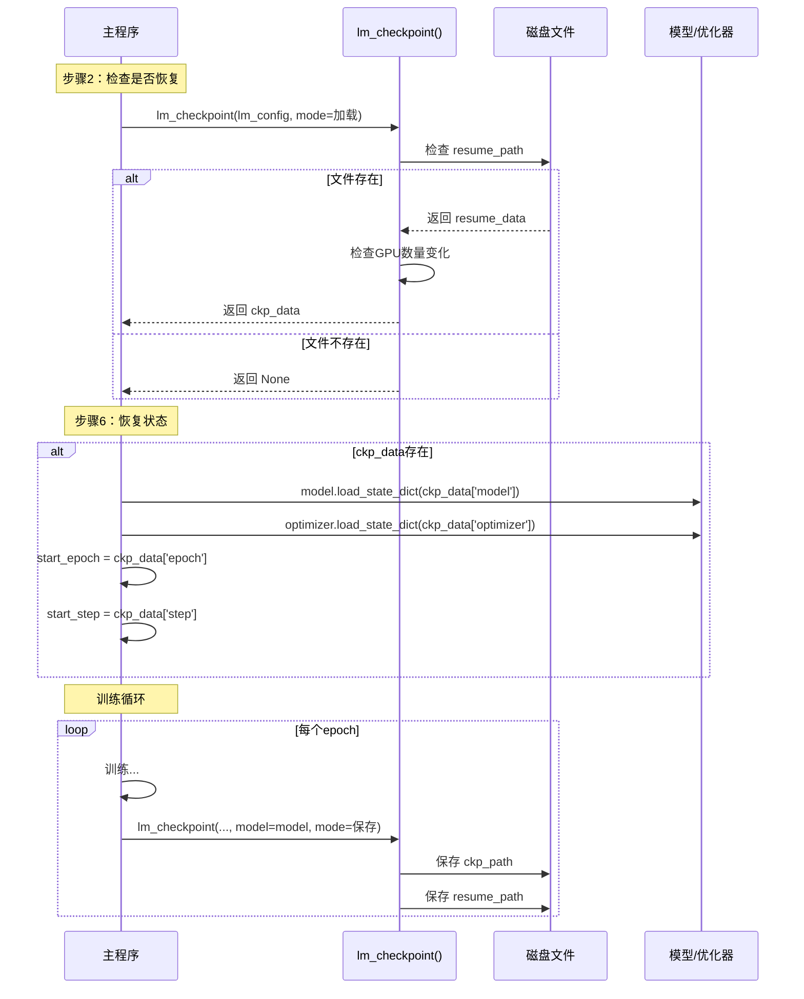

# 04 - 检查点机制与断点续训深度分析

## 一、模块概述

在 `train_full_sft.py` 中，检查点机制贯穿整个训练流程：

```python
# 步骤2：检查是否存在检查点（Line 118）
ckp_data = lm_checkpoint(lm_config, weight=args.save_weight, 
                         save_dir='../checkpoints') if args.from_resume==1 else None

# 步骤6：从检查点恢复状态（Line 141-148）
if ckp_data:
    model.load_state_dict(ckp_data['model'])
    optimizer.load_state_dict(ckp_data['optimizer'])
    scaler.load_state_dict(ckp_data['scaler'])
    start_epoch = ckp_data['epoch']
    start_step = ckp_data.get('step', 0)

# 训练中：保存检查点（Line 77-78）
lm_checkpoint(lm_config, weight=args.save_weight, model=model, 
              optimizer=optimizer, epoch=epoch, step=step, 
              wandb=wandb, save_dir='../checkpoints', scaler=scaler)
```

**核心功能：**
1. **模型保存**：定期保存训练状态
2. **断点续训**：从上次中断处继续训练
3. **多版本管理**：分离推理权重和训练检查点

---

## 二、lm_checkpoint() 函数详解

### 2.1 函数签名

```python
# 文件：trainer/trainer_utils.py, Line 48-102
def lm_checkpoint(
    lm_config,                      # 模型配置对象
    weight='full_sft',              # 权重名称前缀
    model=None,                     # 模型对象（None表示加载模式）
    optimizer=None,                 # 优化器对象
    epoch=0,                        # 当前epoch
    step=0,                         # 当前step
    wandb=None,                     # WandB日志对象
    save_dir='../checkpoints',      # 保存目录
    **kwargs                        # 额外的状态（如scaler）
):
```

**双模式设计：**
- **保存模式**：`model != None` → 保存训练状态
- **加载模式**：`model == None` → 加载已有检查点

---

### 2.2 保存模式：完整源码解析

#### 第1步：生成文件路径

```python
# Line 49-52
os.makedirs(save_dir, exist_ok=True)
moe_path = '_moe' if lm_config.use_moe else ''
ckp_path = f'{save_dir}/{weight}_{lm_config.hidden_size}{moe_path}.pth'
resume_path = f'{save_dir}/{weight}_{lm_config.hidden_size}{moe_path}_resume.pth'
```

**生成的文件名：**

| 配置 | ckp_path | resume_path |
|------|----------|-------------|
| 标准512维模型 | `full_sft_512.pth` | `full_sft_512_resume.pth` |
| MoE 512维模型 | `full_sft_512_moe.pth` | `full_sft_512_moe_resume.pth` |

**两个文件的区别：**

| 文件 | 内容 | 用途 | 大小 |
|------|------|------|------|
| **ckp_path** | 仅模型权重 | 推理、部署 | 较小（~50MB） |
| **resume_path** | 完整训练状态 | 断点续训 | 较大（~150MB） |

---

#### 第2步：提取模型权重（处理DDP）

```python
# Line 54-57
from torch.nn.parallel import DistributedDataParallel

state_dict = model.module.state_dict() if isinstance(model, DistributedDataParallel) \
             else model.state_dict()
```

**为什么需要 `model.module`？**

```python
# DDP包装后的模型结构：
DistributedDataParallel(
    module=MiniMindForCausalLM(...)  # 真正的模型在这里
)

# 直接调用 model.state_dict() 会包含 DDP 的额外键（如 'module.embed_tokens.weight'）
# 使用 model.module.state_dict() 得到纯净的权重（如 'embed_tokens.weight'）
```

---

#### 第3步：权重转换与保存（推理权重）

```python
# Line 58-61
state_dict = {k: v.half().cpu() for k, v in state_dict.items()}
ckp_tmp = ckp_path + '.tmp'
torch.save(state_dict, ckp_tmp)
os.replace(ckp_tmp, ckp_path)
```

**关键技术：**

**1. 转换为FP16：`v.half()`**
- **原始训练精度**：FP32（4字节/参数）
- **保存精度**：FP16（2字节/参数）
- **优势**：文件大小减半，精度损失可忽略

**2. 移到CPU：`v.cpu()`**
- 释放GPU显存
- 兼容不同硬件（CPU推理、不同GPU）

**3. 原子性保存：`.tmp` → `os.replace()`**
```python
# 常见错误做法：
torch.save(state_dict, ckp_path)  # 如果中途失败，文件损坏！

# 正确做法：
torch.save(state_dict, ckp_path + '.tmp')  # 先保存到临时文件
os.replace(ckp_path + '.tmp', ckp_path)    # 原子替换（要么成功，要么保留旧文件）
```

---

#### 第4步：提取WandB ID

```python
# Line 62-68
wandb_id = None
if wandb:
    if hasattr(wandb, 'get_run'):
        run = wandb.get_run()
        wandb_id = getattr(run, 'id', None) if run else None
    else:
        wandb_id = getattr(wandb, 'id', None)
```

**为什么要保存WandB ID？**
- **断点续训时恢复日志**：如果训练中断，续训时可以继续在同一个WandB run中记录
- **保持日志连续性**：避免创建多个不连续的训练曲线

**不同WandB库的兼容性：**
```python
# 标准wandb:    wandb.run.id
# swanlab:      wandb.get_run().id
# 兼容性代码同时支持两者
```

---

#### 第5步：构建完整的训练状态

```python
# Line 70-86
resume_data = {
    'model': state_dict,
    'optimizer': optimizer.state_dict(),
    'epoch': epoch,
    'step': step,
    'world_size': dist.get_world_size() if dist.is_initialized() else 1,
    'wandb_id': wandb_id
}

# 处理额外的状态（如scaler）
for key, value in kwargs.items():
    if value is not None:
        if hasattr(value, 'state_dict'):
            if isinstance(value, DistributedDataParallel):
                resume_data[key] = value.module.state_dict()
            else:
                resume_data[key] = value.state_dict()
        else:
            resume_data[key] = value
```

**resume_data 内容详解：**

| 键 | 类型 | 说明 | 示例 |
|-----|------|------|------|
| **model** | dict | 模型权重（FP16） | {'embed_tokens.weight': tensor(...)} |
| **optimizer** | dict | 优化器状态 | {'state': {...}, 'param_groups': [...]} |
| **epoch** | int | 当前epoch | 1 |
| **step** | int | 当前step | 500 |
| **world_size** | int | GPU数量 | 2 |
| **wandb_id** | str | WandB运行ID | 'abc123xyz' |
| **scaler** | dict | 混合精度缩放器状态 | {'scale': 65536.0, ...} |

**optimizer.state_dict() 包含什么？**
```python
{
    'state': {
        0: {'step': 500, 'exp_avg': tensor(...), 'exp_avg_sq': tensor(...)},
        1: {'step': 500, 'exp_avg': tensor(...), 'exp_avg_sq': tensor(...)},
        ...  # 每个参数的Adam状态（一阶动量、二阶动量）
    },
    'param_groups': [
        {
            'lr': 5e-7,
            'betas': (0.9, 0.999),
            'eps': 1e-8,
            'weight_decay': 0,
            ...
        }
    ]
}
```

**scaler.state_dict() 包含什么？**
```python
{
    'scale': 65536.0,          # 当前梯度缩放因子
    'growth_factor': 2.0,      # 放大因子
    'backoff_factor': 0.5,     # 缩小因子
    'growth_interval': 2000,   # 检测间隔
    '_growth_tracker': 0,      # 内部追踪器
}
```

---

#### 第6步：原子性保存训练状态

```python
# Line 88-91
resume_tmp = resume_path + '.tmp'
torch.save(resume_data, resume_tmp)
os.replace(resume_tmp, resume_path)
del state_dict, resume_data
gc.collect()
torch.cuda.empty_cache()
```

**内存管理：**
- **删除变量**：`del state_dict, resume_data`
- **垃圾回收**：`gc.collect()`（Python层面）
- **清空缓存**：`torch.cuda.empty_cache()`（GPU显存）

---

### 2.3 加载模式：完整源码解析

```python
# Line 93-102
else:  # 加载模式 (model == None)
    if os.path.exists(resume_path):
        ckp_data = torch.load(resume_path, map_location='cpu')
        saved_ws = ckp_data.get('world_size', 1)
        current_ws = dist.get_world_size() if dist.is_initialized() else 1
        
        if saved_ws != current_ws:
            ckp_data['step'] = ckp_data['step'] * saved_ws // current_ws
            Logger(f'GPU数量变化({saved_ws}→{current_ws})，step已自动转换为{ckp_data["step"]}')
        
        return ckp_data
    return None
```

#### 关键技术：GPU数量变化时的step转换

**问题场景：**
```
训练时使用：2个GPU，每个GPU batch_size=16，总batch_size=32
恢复时使用：4个GPU，每个GPU batch_size=16，总batch_size=64
```

**为什么需要转换step？**

```python
# 训练时（2 GPU）：
# Step 100 → 已处理样本数 = 100 * 32 = 3200

# 如果不转换，恢复后（4 GPU）：
# 从Step 100继续 → 跳过 100 * 64 = 6400 个样本  ❌ 错误！

# 正确转换：
# new_step = 100 * 2 / 4 = 50
# Step 50 → 已处理样本数 = 50 * 64 = 3200  ✅ 正确！
```

**转换公式：**
```python
new_step = old_step * old_world_size / new_world_size
```

**实际应用：**
```python
# 保存时：2 GPU, step=500
saved_ws = 2

# 恢复时：4 GPU
current_ws = 4

# 转换：
ckp_data['step'] = 500 * 2 // 4 = 250
```

---

## 三、断点续训完整流程

### 3.1 训练脚本中的检查点调用

#### 流程图



---

### 3.2 代码详解：步骤2（检查检查点）

```python
# Line 118
ckp_data = lm_checkpoint(lm_config, weight=args.save_weight, 
                         save_dir='../checkpoints') if args.from_resume==1 else None
```

**条件判断：`args.from_resume==1`**

| 参数值 | 行为 | 说明 |
|--------|------|------|
| **0（默认）** | 不恢复 | 从头开始训练（或从预训练权重） |
| **1** | 尝试恢复 | 如果存在检查点则续训，否则从头开始 |

**调用示例：**
```bash
# 不续训（默认）
torchrun train_full_sft.py --from_resume 0

# 尝试续训
torchrun train_full_sft.py --from_resume 1
```

---

### 3.3 代码详解：步骤6（恢复状态）

```python
# Line 141-148
start_epoch, start_step = 0, 0
if ckp_data:
    model.load_state_dict(ckp_data['model'])
    optimizer.load_state_dict(ckp_data['optimizer'])
    scaler.load_state_dict(ckp_data['scaler'])
    start_epoch = ckp_data['epoch']
    start_step = ckp_data.get('step', 0)
```

**关键点：**

**1. 恢复顺序很重要**
```python
# 正确顺序：
model.load_state_dict(...)      # 先恢复模型权重
optimizer.load_state_dict(...)  # 再恢复优化器（优化器内部引用模型参数）
scaler.load_state_dict(...)     # 最后恢复scaler
```

**2. 优化器状态为什么重要？**
```python
# 如果不恢复优化器：
# - Adam的动量信息丢失
# - 学习率重置
# - 训练曲线会出现突变

# 恢复后：
# - 动量延续
# - 学习率正确
# - 训练曲线平滑
```

**3. start_step 的作用**
```python
# 用于跳过已训练的batch（见步骤8）
if epoch == start_epoch and start_step > 0:
    batch_sampler = SkipBatchSampler(..., skip_batches=start_step + 1)
```

---

### 3.4 代码详解：步骤8（跳过已训练batch）

```python
# Line 156-165
for epoch in range(start_epoch, args.epochs):
    train_sampler and train_sampler.set_epoch(epoch)
    
    if epoch == start_epoch and start_step > 0:  # 断点续训逻辑
        batch_sampler = SkipBatchSampler(
            train_sampler or range(len(train_ds)), 
            args.batch_size, 
            start_step + 1
        )
        loader = DataLoader(train_ds, batch_sampler=batch_sampler, 
                           num_workers=args.num_workers, pin_memory=True)
        Logger(f'Epoch [{epoch + 1}/{args.epochs}]: 跳过前{start_step}个step，从step {start_step + 1}开始')
        train_epoch(epoch, loader, len(loader) + start_step + 1, start_step, wandb)
    else:  # 正常训练
        loader = DataLoader(train_ds, batch_size=args.batch_size, 
                           shuffle=(train_sampler is None), sampler=train_sampler, 
                           num_workers=args.num_workers, pin_memory=True)
        train_epoch(epoch, loader, len(loader), 0, wandb)
```

#### SkipBatchSampler 实现原理

```python
# 文件：trainer/trainer_utils.py, Line 119-142
class SkipBatchSampler(Sampler):
    def __init__(self, sampler, batch_size, skip_batches=0):
        self.sampler = sampler
        self.batch_size = batch_size
        self.skip_batches = skip_batches
    
    def __iter__(self):
        batch = []
        skipped = 0
        for idx in self.sampler:
            batch.append(idx)
            if len(batch) == self.batch_size:
                if skipped < self.skip_batches:
                    skipped += 1
                    batch = []
                    continue  # 跳过这个batch
                yield batch
                batch = []
        if len(batch) > 0 and skipped >= self.skip_batches:
            yield batch
    
    def __len__(self):
        total_batches = (len(self.sampler) + self.batch_size - 1) // self.batch_size
        return max(0, total_batches - self.skip_batches)
```

**工作原理：**

```python
# 假设：
# - 数据集大小：1000
# - batch_size: 16
# - skip_batches: 50

# 原始batch序列：[0-15], [16-31], ..., [784-799], [800-815], ...

# SkipBatchSampler：
# - 跳过前50个batch（0-799）
# - 从第51个batch开始：[800-815], [816-831], ...
```

---

## 四、训练中的检查点保存

### 4.1 保存时机

```python
# 在 train_epoch() 函数中，Line 67-78
if (step % args.save_interval == 0 or step == iters - 1) and is_main_process():
    model.eval()
    moe_suffix = '_moe' if lm_config.use_moe else ''
    ckp = f'{args.save_dir}/{args.save_weight}_{lm_config.hidden_size}{moe_suffix}.pth'
    
    if isinstance(model, torch.nn.parallel.DistributedDataParallel):
        state_dict = model.module.state_dict()
    else:
        state_dict = model.state_dict()
    
    state_dict = {k: v.half().cpu() for k, v in state_dict.items()}
    torch.save(state_dict, ckp)
    
    lm_checkpoint(lm_config, weight=args.save_weight, model=model, 
                  optimizer=optimizer, epoch=epoch, step=step, 
                  wandb=wandb, save_dir='../checkpoints', scaler=scaler)
    model.train()
    del state_dict
```

**保存条件：**
1. **定期保存**：`step % args.save_interval == 0`（默认每100步）
2. **epoch结束**：`step == iters - 1`
3. **仅主进程**：`is_main_process()`（避免多进程重复保存）

**保存内容：**
1. **推理权重**：保存到 `args.save_dir`（如 `../out/full_sft_512.pth`）
2. **训练检查点**：通过 `lm_checkpoint()` 保存到 `../checkpoints/full_sft_512_resume.pth`

---

### 4.2 多进程保存的问题

**问题：如果所有进程都保存会怎样？**

```python
# 错误做法：
# 进程0保存：full_sft_512.pth
# 进程1保存：full_sft_512.pth  ← 覆盖！
# 进程2保存：full_sft_512.pth  ← 再次覆盖！
# 结果：文件损坏或状态不一致

# 正确做法：
if is_main_process():  # 只有进程0保存
    torch.save(state_dict, ckp)
```

**is_main_process() 实现：**
```python
def is_main_process():
    return not dist.is_initialized() or dist.get_rank() == 0
```

---

## 五、实战案例：完整的训练恢复流程

### 5.1 场景描述

**初始训练：**
```bash
# 2个GPU，训练2个epoch
CUDA_VISIBLE_DEVICES=0,1 torchrun --nproc_per_node 2 train_full_sft.py \
  --batch_size 16 \
  --epochs 2 \
  --hidden_size 512 \
  --save_interval 100
```

**训练过程：**
```
Epoch 1:
  Step 100/500 → 保存检查点（ckp + resume）
  Step 200/500 → 保存检查点
  Step 300/500 → 保存检查点
  Step 350/500 → ⚠️ 训练中断（断电/OOM）
```

**恢复训练：**
```bash
# 使用4个GPU恢复（GPU数量变化）
CUDA_VISIBLE_DEVICES=0,1,2,3 torchrun --nproc_per_node 4 train_full_sft.py \
  --batch_size 16 \
  --epochs 2 \
  --hidden_size 512 \
  --from_resume 1  # ← 启用恢复模式
```

---

### 5.2 恢复流程详解

#### 步骤1：加载检查点

```python
# 执行 Line 118
ckp_data = lm_checkpoint(lm_config, weight='full_sft', save_dir='../checkpoints')

# 返回：
{
    'model': {...},          # FP16权重
    'optimizer': {...},      # Adam状态
    'scaler': {...},         # 混合精度状态
    'epoch': 0,              # 第0个epoch（从0开始）
    'step': 300,             # 第300步
    'world_size': 2,         # 保存时用2个GPU
    'wandb_id': 'abc123'
}
```

#### 步骤2：GPU数量转换

```python
# lm_checkpoint() 内部自动转换
saved_ws = 2
current_ws = 4

# 转换step：
new_step = 300 * 2 // 4 = 150
ckp_data['step'] = 150

# 打印日志：
# GPU数量变化(2→4)，step已自动转换为150
```

#### 步骤3：恢复状态

```python
# Line 141-148
start_epoch = 0
start_step = 150

model.load_state_dict(ckp_data['model'])
optimizer.load_state_dict(ckp_data['optimizer'])
scaler.load_state_dict(ckp_data['scaler'])
```

#### 步骤4：跳过已训练batch

```python
# Line 158-162
# epoch=0, start_step=150
batch_sampler = SkipBatchSampler(train_sampler, batch_size=16, skip_batches=151)

# 效果：跳过前151个batch（0-150），从第151个batch开始
```

#### 步骤5：继续训练

```python
# 训练从 epoch=0, step=151 继续
Epoch [1/2]: 跳过前150个step，从step 151开始
Epoch:[1/2](151/500) loss:1.234567 lr:0.000000345 ...
Epoch:[1/2](152/500) loss:1.234567 lr:0.000000345 ...
...
```

---

### 5.3 已处理样本数验证

```python
# 中断前（2 GPU）：
# - Step 300
# - 每GPU batch_size = 16
# - 总batch_size = 32
# - 已处理样本数 = 300 * 32 = 9600

# 恢复后（4 GPU）：
# - Step 150（转换后）
# - 每GPU batch_size = 16
# - 总batch_size = 64
# - 已处理样本数 = 150 * 64 = 9600  ✅ 一致！
```

---

## 六、检查点文件实战

### 6.1 查看检查点内容

```python
import torch

# 加载检查点
ckp_data = torch.load('../checkpoints/full_sft_512_resume.pth', map_location='cpu')

# 查看键
print(ckp_data.keys())
# dict_keys(['model', 'optimizer', 'scaler', 'epoch', 'step', 'world_size', 'wandb_id'])

# 查看训练进度
print(f"Epoch: {ckp_data['epoch']}")
print(f"Step: {ckp_data['step']}")
print(f"GPU数量: {ckp_data['world_size']}")

# 查看优化器学习率
print(f"学习率: {ckp_data['optimizer']['param_groups'][0]['lr']}")

# 查看scaler状态
print(f"梯度缩放因子: {ckp_data['scaler']['scale']}")
```

---

### 6.2 文件大小对比

**实际测试（512维模型）：**

| 文件 | 大小 | 说明 |
|------|------|------|
| `full_sft_512.pth` | 52 MB | 仅模型权重（FP16） |
| `full_sft_512_resume.pth` | 156 MB | 完整训练状态 |

**差异来源：**
```python
# full_sft_512.pth:
model_params = 26M * 2字节(FP16) = 52MB

# full_sft_512_resume.pth:
model_params = 52MB
optimizer_states = 26M * 2 * 4字节(Adam两个动量, FP32) = 104MB
other_states = ~0.5MB
total = 156.5MB
```

---

## 七、常见问题与解决方案

### Q1: 恢复训练后loss突然变大？

**可能原因：**
1. **优化器状态未恢复**：检查是否调用了 `optimizer.load_state_dict()`
2. **scaler状态未恢复**：混合精度训练必须恢复scaler
3. **学习率调度器**：如果有lr_scheduler，也需要恢复

**解决方案：**
```python
# 确保恢复所有状态
model.load_state_dict(ckp_data['model'])
optimizer.load_state_dict(ckp_data['optimizer'])
scaler.load_state_dict(ckp_data['scaler'])

# 如果使用lr_scheduler:
if 'scheduler' in ckp_data:
    scheduler.load_state_dict(ckp_data['scheduler'])
```

---

### Q2: GPU数量变化后，训练效果不一致？

**原因：**
- Batch size变化影响梯度累积
- 学习率需要相应调整

**解决方案：**
```python
# 线性缩放规则（Linear Scaling Rule）
# new_lr = old_lr * (new_batch_size / old_batch_size)

old_batch_size = 2 * 16 = 32
new_batch_size = 4 * 16 = 64

new_lr = old_lr * (64 / 32) = old_lr * 2
```

---

### Q3: 多机训练时如何共享检查点？

**解决方案：**
```python
# 使用共享存储（NFS、对象存储等）
save_dir = '/shared/checkpoints'  # 所有节点都能访问

# 或者：仅在主节点保存，其他节点从主节点拷贝
if dist.get_rank() == 0:
    torch.save(...)
dist.barrier()  # 等待主节点保存完成
```

---

## 八、知识点总结

### 核心概念

| 概念 | 说明 |
|------|------|
| **检查点（Checkpoint）** | 保存的训练状态快照，包含模型权重和训练进度 |
| **推理权重（Inference Weight）** | 仅包含模型参数，用于部署和推理 |
| **训练检查点（Resume）** | 包含完整训练状态，用于断点续训 |
| **原子性保存** | 使用 `.tmp` 文件和 `os.replace()` 确保保存安全 |
| **GPU数量转换** | `new_step = old_step * old_ws / new_ws` |
| **SkipBatchSampler** | 跳过已训练batch的采样器 |

### 关键代码

```python
# 保存检查点
lm_checkpoint(lm_config, weight='full_sft', model=model, 
              optimizer=optimizer, epoch=epoch, step=step, 
              wandb=wandb, scaler=scaler)

# 加载检查点
ckp_data = lm_checkpoint(lm_config, weight='full_sft') if args.from_resume==1 else None

# 恢复状态
if ckp_data:
    model.load_state_dict(ckp_data['model'])
    optimizer.load_state_dict(ckp_data['optimizer'])
    scaler.load_state_dict(ckp_data['scaler'])
    start_epoch = ckp_data['epoch']
    start_step = ckp_data['step']
```

---

**状态：** ✅ 已完成检查点机制与断点续训深度分析
