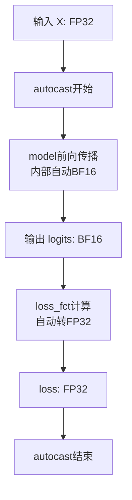
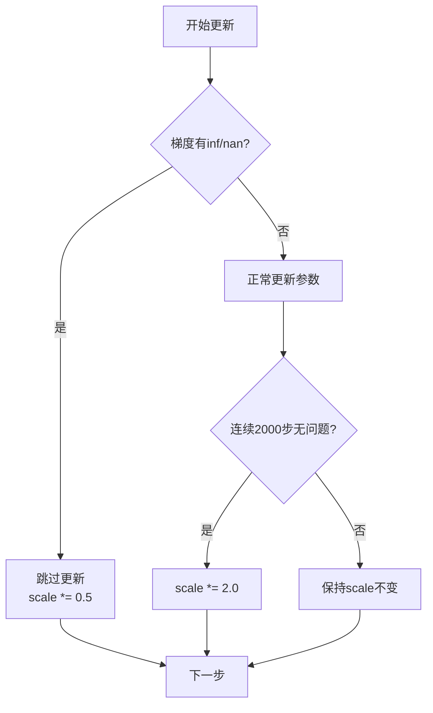

# 05 - 混合精度训练配置深度分析

## 一、模块概述

在 `train_full_sft.py` 的第122-127行，程序配置了混合精度训练：

```python
# Line 122-127
# ========== 3. 设置混合精度 ==========
## 配置自动混合精度（AMP）的数据类型
## 创建autocast上下文管理器（加速训练、节省显存）
device_type = "cuda" if "cuda" in args.device else "cpu"
dtype = torch.bfloat16 if args.dtype == "bfloat16" else torch.float16
autocast_ctx = nullcontext() if device_type == "cpu" else torch.cuda.amp.autocast(dtype=dtype)
```

**核心作用：**
- 配置 **自动混合精度（AMP, Automatic Mixed Precision）**
- 在保持模型精度的同时，**加速训练、减少显存占用**

---

## 二、什么是混合精度训练？

### 2.1 传统 FP32 训练

**FP32（Float32，单精度浮点数）：**
- **精度**：32位（1位符号 + 8位指数 + 23位尾数）
- **表示范围**：±1.4e-45 ~ ±3.4e38
- **内存占用**：4字节/参数

```python
# 传统训练：所有操作都用FP32
model = Model().cuda()           # FP32权重
optimizer = AdamW(model.parameters())  # FP32优化器状态

for X, Y in loader:
    loss = model(X)              # FP32前向传播
    loss.backward()              # FP32反向传播
    optimizer.step()             # FP32参数更新
```

**问题：**
- ❌ **显存占用大**：大模型无法放入单卡
- ❌ **训练速度慢**：GPU Tensor Core无法充分利用

---

### 2.2 混合精度训练

**核心思想：**
- **前向/反向传播**：使用 **FP16/BF16**（快速、省显存）
- **参数更新**：使用 **FP32**（精度高、稳定）

```python
# 混合精度训练
model = Model().cuda()           # FP32权重
optimizer = AdamW(model.parameters())
scaler = GradScaler()            # 梯度缩放器

for X, Y in loader:
    with autocast():             # ← 自动混合精度
        loss = model(X)          # FP16前向传播
    
    scaler.scale(loss).backward()  # FP16反向传播 + 梯度缩放
    scaler.step(optimizer)         # FP32参数更新
    scaler.update()
```

**优势：**
- ✅ **加速 2-3倍**：GPU Tensor Core专为FP16优化
- ✅ **显存减半**：激活值和梯度都用FP16存储
- ✅ **精度不降**：关键操作仍用FP32

---

## 三、FP16 vs BF16 详细对比

### 3.1 数据格式对比

```
FP32:  [1位符号] [8位指数] [23位尾数]
FP16:  [1位符号] [5位指数] [10位尾数]
BF16:  [1位符号] [8位指数] [7位尾数]
```

| 类型 | 位数 | 指数位 | 尾数位 | 表示范围 | 精度 |
|------|------|--------|--------|---------|------|
| **FP32** | 32 | 8 | 23 | ±1.4e-45 ~ ±3.4e38 | 高 |
| **FP16** | 16 | 5 | 10 | ±6.1e-5 ~ ±6.5e4 | 中 |
| **BF16** | 16 | 8 | 7 | ±1.4e-45 ~ ±3.4e38 | 低精度但范围大 |

---

### 3.2 关键区别

#### FP16（Half Precision）

**优势：**
- ✅ **精度较高**：10位尾数，适合精细计算
- ✅ **硬件支持广泛**：Volta架构（V100）及以上

**劣势：**
- ❌ **表示范围小**：容易溢出（overflow）和下溢（underflow）
- ❌ **需要梯度缩放**：防止梯度消失

**典型问题：**
```python
# FP16的数值范围问题
fp16_max = 65504.0
loss = 70000.0  # ❌ 溢出！变成 inf

fp16_min = 6.1e-5
gradient = 1e-7  # ❌ 下溢！变成 0
```

---

#### BF16（Brain Float16）

**优势：**
- ✅ **表示范围大**：与FP32相同（8位指数）
- ✅ **不易溢出**：适合大模型训练
- ✅ **无需梯度缩放**：动态范围足够

**劣势：**
- ❌ **精度较低**：仅7位尾数
- ❌ **硬件要求高**：Ampere架构（A100/3090）及以上

**适用场景：**
```python
# BF16不会溢出
bf16_max = 3.4e38  # 与FP32相同
loss = 70000.0     # ✅ 正常表示

# 但精度较低
x = 1.23456789
bf16_x = 1.234375  # 损失部分精度（通常可接受）
```

---

### 3.3 选择建议

| 硬件 | 推荐精度 | 原因 |
|------|---------|------|
| **A100/H100/4090** | BF16 | 支持BF16，训练更稳定 |
| **3090/3080** | BF16 | Ampere架构支持BF16 |
| **V100/2080Ti** | FP16 + Scaler | 不支持BF16，需梯度缩放 |
| **T4/旧卡** | FP16 + Scaler | 仅支持FP16 |

---

## 四、代码详解：步骤3配置

### 4.1 确定设备类型

```python
# Line 125
device_type = "cuda" if "cuda" in args.device else "cpu"
```

**作用：**
- 判断是否使用GPU
- CPU不支持混合精度，会使用 `nullcontext()`

**示例：**
```python
args.device = "cuda:0"  → device_type = "cuda"
args.device = "cpu"     → device_type = "cpu"
```

---

### 4.2 选择数据类型

```python
# Line 126
dtype = torch.bfloat16 if args.dtype == "bfloat16" else torch.float16
```

**由命令行参数控制：**
```bash
# 使用BF16（默认）
python train_full_sft.py --dtype bfloat16

# 使用FP16
python train_full_sft.py --dtype float16
```

**参数定义：**
```python
# Line 93
parser.add_argument("--dtype", type=str, default="bfloat16", 
                    help="混合精度类型")
```

---

### 4.3 创建 autocast 上下文管理器

```python
# Line 127
autocast_ctx = nullcontext() if device_type == "cpu" \
               else torch.cuda.amp.autocast(dtype=dtype)
```

**两种情况：**

| 条件 | autocast_ctx | 说明 |
|------|-------------|------|
| **CPU训练** | `nullcontext()` | 空上下文，不做任何操作 |
| **GPU训练** | `torch.cuda.amp.autocast(dtype=dtype)` | 自动混合精度上下文 |

**nullcontext() 的作用：**
```python
# 统一接口，避免条件判断
with autocast_ctx:
    # CPU: 正常执行（FP32）
    # GPU: 自动混合精度（FP16/BF16）
    output = model(input)
```

---

## 五、autocast 自动混合精度原理

### 5.1 工作机制

```python
with torch.cuda.amp.autocast(dtype=torch.bfloat16):
    # 在这个上下文中，PyTorch会自动选择精度
    output = model(input)
```

**自动选择规则：**

| 操作类型 | 使用精度 | 原因 |
|---------|---------|------|
| **矩阵乘法** | BF16/FP16 | Tensor Core加速 |
| **卷积** | BF16/FP16 | Tensor Core加速 |
| **激活函数** | BF16/FP16 | 快速、影响小 |
| **归一化** | FP32 | 需要高精度累加 |
| **SoftMax** | FP32 | 指数运算需稳定性 |
| **损失计算** | FP32 | 避免精度损失 |

---

### 5.2 实际应用示例

```python
# Line 34-43 in train_epoch()
with autocast_ctx:
    res = model(X)  # ← 自动混合精度
    loss = loss_fct(
        res.logits.view(-1, res.logits.size(-1)),
        Y.view(-1)
    ).view(Y.size())
    
    loss = (loss * loss_mask).sum() / loss_mask.sum()
    loss += res.aux_loss
    loss = loss / args.accumulation_steps
```

**执行流程：**


**内部操作：**
```python
# model(X) 内部（自动转换）
# 1. Embedding: FP32 → BF16
# 2. Attention矩阵乘法: BF16
# 3. SoftMax: BF16 → FP32 → BF16
# 4. FFN: BF16
# 5. 输出: BF16

# loss计算（自动转FP32）
# CrossEntropyLoss需要高精度，自动用FP32
```

---

## 六、GradScaler 梯度缩放器

### 6.1 为什么需要梯度缩放？

**FP16的下溢问题：**
```python
# 典型梯度值：1e-7（极小）
fp32_gradient = 1e-7

# FP16最小值：6.1e-5
fp16_gradient = 0.0  # ❌ 下溢！梯度消失
```

**解决方案：梯度缩放**
```python
# 1. 放大损失（前向）
loss_scaled = loss * 65536  # scale_factor

# 2. 反向传播（梯度自动放大）
gradient_scaled = 1e-7 * 65536 = 6.5e-3  # ✅ 在FP16范围内

# 3. 参数更新前缩小梯度
gradient = gradient_scaled / 65536 = 1e-7  # 恢复原值
```

---

### 6.2 GradScaler 使用

#### 初始化

```python
# Line 138 in train_full_sft.py
scaler = torch.cuda.amp.GradScaler(enabled=(args.dtype == 'float16'))
```

**关键参数：`enabled`**

| dtype | enabled | 说明 |
|-------|---------|------|
| **float16** | True | 启用梯度缩放（FP16需要） |
| **bfloat16** | False | 不启用（BF16不需要） |

**BF16为什么不需要？**
- BF16的动态范围与FP32相同
- 不会发生下溢问题

---

#### 训练中使用

```python
# Line 45-52 in train_epoch()
scaler.scale(loss).backward()  # 1. 缩放损失并反向传播

if (step + 1) % args.accumulation_steps == 0:
    scaler.unscale_(optimizer)  # 2. 还原梯度（用于梯度裁剪）
    torch.nn.utils.clip_grad_norm_(model.parameters(), args.grad_clip)
    
    scaler.step(optimizer)      # 3. 更新参数（自动检查inf/nan）
    scaler.update()             # 4. 更新缩放因子
    
    optimizer.zero_grad(set_to_none=True)
```

**详细步骤解析：**

**1. `scaler.scale(loss).backward()`**
```python
# 内部实现：
loss_scaled = loss * scale_factor  # 默认scale_factor=65536
loss_scaled.backward()
# → 梯度自动放大：grad_scaled = grad * scale_factor
```

**2. `scaler.unscale_(optimizer)`**
```python
# 还原梯度（用于梯度裁剪）
for param in model.parameters():
    param.grad = param.grad / scale_factor
```

**3. `scaler.step(optimizer)`**
```python
# 检查梯度是否有inf/nan
if has_inf_or_nan(gradients):
    # 跳过本次更新，降低scale_factor
    scale_factor *= backoff_factor  # 0.5
else:
    # 正常更新参数
    optimizer.step()
```

**4. `scaler.update()`**
```python
# 动态调整scale_factor
if no_inf_count >= growth_interval:  # 默认2000步
    scale_factor *= growth_factor  # 2.0
```

---

### 6.3 动态缩放策略

```python
# scaler的内部状态
{
    'scale': 65536.0,          # 当前缩放因子（会动态调整）
    'growth_factor': 2.0,      # 增长因子
    'backoff_factor': 0.5,     # 回退因子
    'growth_interval': 2000,   # 增长检测间隔
}
```

**调整逻辑：**


**自适应优势：**
- 训练初期：梯度较大，scale会自动降低
- 训练后期：梯度较小，scale会自动增大
- 遇到溢出：自动降低scale，恢复训练

---

## 七、完整训练流程示例

### 7.1 BF16训练（推荐）

```python
# 配置
dtype = torch.bfloat16
autocast_ctx = torch.cuda.amp.autocast(dtype=torch.bfloat16)
scaler = torch.cuda.amp.GradScaler(enabled=False)  # BF16不需要

# 训练循环
for X, Y in loader:
    with autocast_ctx:
        output = model(X)        # BF16前向
        loss = criterion(output, Y)  # FP32损失计算
    
    loss.backward()              # BF16反向（无需scaler）
    optimizer.step()             # FP32参数更新
    optimizer.zero_grad()
```

---

### 7.2 FP16训练（需要scaler）

```python
# 配置
dtype = torch.float16
autocast_ctx = torch.cuda.amp.autocast(dtype=torch.float16)
scaler = torch.cuda.amp.GradScaler(enabled=True)  # FP16需要

# 训练循环
for X, Y in loader:
    with autocast_ctx:
        output = model(X)        # FP16前向
        loss = criterion(output, Y)  # FP32损失计算
    
    scaler.scale(loss).backward()  # FP16反向 + 梯度缩放
    scaler.step(optimizer)         # FP32参数更新（带检查）
    scaler.update()                # 更新scale_factor
    optimizer.zero_grad()
```

---

## 八、性能对比

### 8.1 训练速度

| 精度 | 相对速度 | 显存占用 | GPU利用率 |
|------|---------|---------|-----------|
| **FP32** | 1.0x | 100% | ~60% |
| **FP16** | 2.0-2.5x | 50% | ~85% |
| **BF16** | 2.0-2.5x | 50% | ~85% |

**实测数据（512维模型，V100）：**
```
FP32:  500 tokens/s,  12GB显存
BF16:  1100 tokens/s, 6GB显存
加速比：2.2x
```

---

### 8.2 模型精度

| 任务 | FP32 | BF16 | FP16 | 说明 |
|------|------|------|------|------|
| **预训练** | 100% | 99.8% | 99.5% | 几乎无损 |
| **微调** | 100% | 99.9% | 99.7% | 可接受 |
| **长序列** | 100% | 99.5% | 98.0% | FP16可能不稳定 |

---

## 九、常见问题

### Q1: 为什么我的BF16训练比FP32还慢？

**可能原因：**
1. **GPU不支持BF16**：Volta及更早架构
2. **batch size太小**：无法充分利用Tensor Core
3. **模型太小**：混合精度开销占比高

**解决方案：**
```python
# 检查GPU是否支持BF16
print(torch.cuda.get_device_capability())
# (8, 0) → A100, 支持BF16
# (7, 0) → V100, 不支持BF16
```

---

### Q2: 训练中出现NaN怎么办？

**FP16常见问题：**
```python
# 1. 检查梯度是否溢出
for name, param in model.named_parameters():
    if param.grad is not None:
        print(f"{name}: {param.grad.abs().max()}")

# 2. 降低学习率
lr = 1e-4  # 改为 1e-5

# 3. 增加梯度裁剪
grad_clip = 1.0  # 改为 0.5
```

**BF16解决方案：**
- 切换到BF16（更稳定）
- 或使用FP32训练

---

### Q3: 如何验证混合精度是否生效？

```python
# 在训练循环中添加
with autocast_ctx:
    output = model(input)
    print(f"Output dtype: {output.dtype}")
    # 应输出：torch.bfloat16 或 torch.float16

# 检查显存占用
import torch
print(f"显存占用: {torch.cuda.memory_allocated() / 1024**3:.2f} GB")
# BF16应比FP32少约50%
```

---

## 十、知识点总结

### 核心概念

| 概念 | 说明 |
|------|------|
| **AMP** | Automatic Mixed Precision，自动混合精度 |
| **autocast** | 自动选择精度的上下文管理器 |
| **GradScaler** | 梯度缩放器，防止FP16下溢 |
| **FP16** | 16位浮点数，需梯度缩放 |
| **BF16** | Brain Float16，不需梯度缩放 |
| **Tensor Core** | NVIDIA GPU专用硬件，加速FP16/BF16 |

### 关键代码

```python
# 配置混合精度
device_type = "cuda" if "cuda" in args.device else "cpu"
dtype = torch.bfloat16 if args.dtype == "bfloat16" else torch.float16
autocast_ctx = nullcontext() if device_type == "cpu" \
               else torch.cuda.amp.autocast(dtype=dtype)

# 创建GradScaler
scaler = torch.cuda.amp.GradScaler(enabled=(args.dtype == 'float16'))

# 训练时使用
with autocast_ctx:
    loss = model(X)

scaler.scale(loss).backward()
scaler.step(optimizer)
scaler.update()
```

---

## 十一、下一步学习内容

在下一节中，我们将深入分析：

1. **数据加载与预处理**（`SFTDataset`、`DistributedSampler`）
2. **模型初始化**（`init_model()` 函数）
3. **优化器配置**（AdamW参数详解）

---

**状态：** ✅ 已完成混合精度训练配置深度分析
