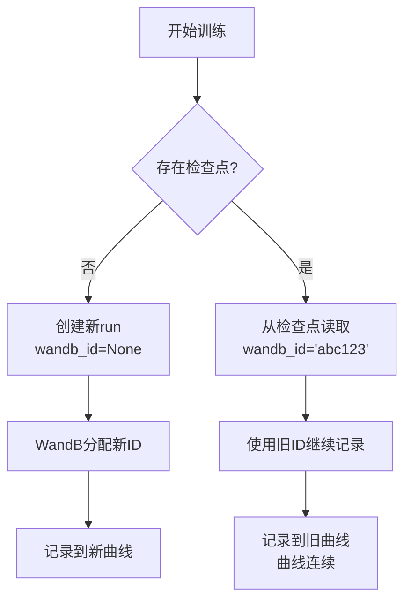

# 06 - WandB 日志系统配置详解

## 一、模块概述

在 `train_full_sft.py` 的第129-138行，程序配置了WandB日志系统：

```python
# Line 129-138
# ========== 4. 配wandb日志系统 ==========
## 仅在主进程初始化日志系统
## 支持断点续训时恢复日志记录
wandb = None
if args.use_wandb and is_main_process():
    import swanlab as wandb
    wandb_id = ckp_data.get('wandb_id') if ckp_data else None
    resume = 'must' if wandb_id else None
    wandb_run_name = f"MiniMind-Full-SFT-Epoch-{args.epochs}-BatchSize-{args.batch_size}-LearningRate-{args.learning_rate}"
    wandb.init(project=args.wandb_project, name=wandb_run_name, id=wandb_id, resume=resume)
```

**核心作用：**
- 记录训练过程中的**指标**（loss、学习率等）
- 可视化训练曲线
- 支持**断点续训后的日志连续性**

---

## 二、什么是 WandB？

### 2.1 WandB 简介

**WandB（Weights & Biases）：**
- 机器学习实验跟踪平台
- 自动记录和可视化训练指标
- 支持团队协作和实验对比

**SwanLab：**
- 中国本土的实验跟踪平台
- API与WandB兼容
- MiniMind项目使用SwanLab替代WandB

---

### 2.2 为什么使用日志系统？

| 传统方式 | 使用WandB |
|---------|----------|
| `print(f"loss: {loss}")` | 自动记录到云端 |
| 无法查看历史训练 | 所有实验永久保存 |
| 难以对比实验 | 可视化对比多个实验 |
| 手动保存日志 | 自动同步 |

---

## 三、配置代码详解

### 3.1 检查是否启用WandB

```python
# Line 132-133
wandb = None
if args.use_wandb and is_main_process():
```

**两个条件：**

| 条件 | 说明 |
|------|------|
| **args.use_wandb** | 命令行参数控制 |
| **is_main_process()** | 仅主进程记录日志 |

**命令行使用：**
```bash
# 启用WandB
torchrun train_full_sft.py --use_wandb

# 不启用（默认）
torchrun train_full_sft.py
```

**为什么只在主进程？**
```python
# 如果所有进程都记录：
# 进程0记录：loss=1.23
# 进程1记录：loss=1.23  ← 重复！
# 进程2记录：loss=1.23  ← 重复！
# 结果：相同指标被记录多次

# 正确做法：只有进程0记录
if is_main_process():
    wandb.log({"loss": loss})
```

---

### 3.2 导入库

```python
# Line 134
import swanlab as wandb
```

**为什么用 swanlab？**
- SwanLab是国内平台，访问更快
- API与WandB完全兼容
- 可以无缝切换（只需改import）

**切换到WandB：**
```python
import wandb  # 直接使用wandb库
```

---

### 3.3 恢复检查点的WandB ID

```python
# Line 135-136
wandb_id = ckp_data.get('wandb_id') if ckp_data else None
resume = 'must' if wandb_id else None
```

**断点续训时的日志连续性：**



**参数说明：**

| 参数 | 值 | 说明 |
|------|-----|------|
| **wandb_id** | None | 首次训练，创建新run |
| **wandb_id** | 'abc123' | 恢复训练，使用旧run ID |
| **resume** | None | 创建新run |
| **resume** | 'must' | 必须恢复旧run（找不到会报错） |

---

### 3.4 生成运行名称

```python
# Line 137
wandb_run_name = f"MiniMind-Full-SFT-Epoch-{args.epochs}-BatchSize-{args.batch_size}-LearningRate-{args.learning_rate}"
```

**生成示例：**
```python
# 参数：epochs=2, batch_size=16, lr=5e-7
# 名称：MiniMind-Full-SFT-Epoch-2-BatchSize-16-LearningRate-5e-07
```

**作用：**
- 在WandB界面中快速识别实验
- 包含关键超参数，便于对比

---

### 3.5 初始化WandB

```python
# Line 138
wandb.init(
    project=args.wandb_project,  # 项目名
    name=wandb_run_name,          # 运行名称
    id=wandb_id,                  # 运行ID（续训时使用）
    resume=resume                 # 是否恢复
)
```

**参数详解：**

| 参数 | 默认值 | 说明 | 示例 |
|------|--------|------|------|
| **project** | "MiniMind-Full-SFT" | 项目名称 | 所有实验归属的项目 |
| **name** | 自动生成 | 本次运行名称 | 在项目中显示的名称 |
| **id** | None/旧ID | 运行唯一ID | 续训时使用旧ID |
| **resume** | None/'must' | 恢复模式 | 'must'表示必须恢复 |

**项目参数定义：**
```python
# Line 107
parser.add_argument("--wandb_project", type=str, default="MiniMind-Full-SFT", 
                    help="wandb项目名")
```

---

## 四、训练中记录日志

### 4.1 记录位置

```python
# Line 57-65 in train_epoch()
if step % args.log_interval == 0 or step == iters - 1:
    spend_time = time.time() - start_time
    current_loss = loss.item() * args.accumulation_steps
    current_lr = optimizer.param_groups[-1]['lr']
    eta_min = spend_time / (step + 1) * iters // 60 - spend_time // 60
    
    Logger(f'Epoch:[{epoch+1}/{args.epochs}]({step}/{iters}) loss:{current_loss:.6f} lr:{current_lr:.12f} epoch_Time:{eta_min}min:')
    
    if wandb: wandb.log({"loss": current_loss, "lr": current_lr, "epoch_Time": eta_min})
```

**记录时机：**
1. **定期记录**：每 `log_interval` 步（默认100步）
2. **epoch结束**：`step == iters - 1`

**参数定义：**
```python
# Line 97
parser.add_argument("--log_interval", type=int, default=100, 
                    help="日志打印间隔")
```

---

### 4.2 记录的指标

```python
wandb.log({
    "loss": current_loss,      # 当前损失
    "lr": current_lr,          # 当前学习率
    "epoch_Time": eta_min      # 预估剩余时间（分钟）
})
```

**指标计算：**

```python
# 1. 损失（恢复梯度累积的缩放）
current_loss = loss.item() * args.accumulation_steps

# 2. 学习率（从优化器读取）
current_lr = optimizer.param_groups[-1]['lr']

# 3. 预估剩余时间
spend_time = time.time() - start_time  # 已用时间
eta_min = spend_time / (step + 1) * iters // 60 - spend_time // 60
# = (预估总时间 - 已用时间) / 60秒
```

---

## 五、检查点中的WandB ID保存

### 5.1 保存WandB ID

在 `lm_checkpoint()` 函数中（trainer_utils.py, Line 62-68）：

```python
wandb_id = None
if wandb:
    if hasattr(wandb, 'get_run'):
        run = wandb.get_run()
        wandb_id = getattr(run, 'id', None) if run else None
    else:
        wandb_id = getattr(wandb, 'id', None)
```

**兼容不同库：**
- **SwanLab**：`wandb.get_run().id`
- **标准WandB**：`wandb.id` 或 `wandb.run.id`

**保存到检查点：**
```python
resume_data = {
    'model': state_dict,
    'optimizer': optimizer.state_dict(),
    'epoch': epoch,
    'step': step,
    'wandb_id': wandb_id,  # ← 保存ID
    ...
}
```

---

### 5.2 断点续训示例

**首次训练：**
```bash
torchrun train_full_sft.py --use_wandb --epochs 2
```

```python
# WandB初始化
wandb_id = None  # 无检查点
resume = None
wandb.init(project="MiniMind-Full-SFT", id=None, resume=None)
# WandB分配新ID: 'abc123xyz'

# 训练到step 500后中断...

# 保存检查点时：
resume_data['wandb_id'] = 'abc123xyz'
```

**恢复训练：**
```bash
torchrun train_full_sft.py --use_wandb --from_resume 1 --epochs 2
```

```python
# 加载检查点
ckp_data = lm_checkpoint(...)
wandb_id = ckp_data.get('wandb_id')  # 'abc123xyz'
resume = 'must'

# WandB初始化
wandb.init(project="MiniMind-Full-SFT", id='abc123xyz', resume='must')
# 继续在原run中记录，曲线连续！
```

---

## 六、WandB 可视化界面

### 6.1 训练曲线

访问WandB/SwanLab网页查看：

```
Loss曲线：
  ↑
3.5|    *
3.0|   *  *
2.5|  *     *
2.0| *        *
1.5|*           *___
   |________________→ Step
   0   500  1000 1500

学习率曲线（Cosine衰减）：
    ↑
5e-7|*
4e-7| *
3e-7|  **
2e-7|    ***
1e-7|       *****_____
    |________________→ Step
    0   500  1000 1500
```

---

### 6.2 实验对比

可以同时查看多个实验：

| Run名称 | Batch Size | LR | 最终Loss |
|---------|-----------|-----|---------|
| Run-1 | 16 | 5e-7 | 1.23 |
| Run-2 | 32 | 1e-6 | 1.18 |
| Run-3 | 16 | 1e-6 | 1.45 |

**结论**：Run-2效果最好（batch_size=32, lr=1e-6）

---

## 七、完整流程示例

### 7.1 首次训练

```bash
# 启动训练，启用WandB
CUDA_VISIBLE_DEVICES=0,1 torchrun --nproc_per_node 2 train_full_sft.py \
  --use_wandb \
  --wandb_project "MyProject" \
  --epochs 2 \
  --batch_size 16
```

**执行流程：**
```python
1. args.use_wandb = True
2. is_main_process() = True (进程0)
3. ckp_data = None (无检查点)
4. wandb_id = None
5. resume = None
6. wandb.init(project="MyProject", id=None, resume=None)
   → WandB创建新run: 'run_abc123'
7. 训练过程中每100步记录一次指标
8. 保存检查点时记录wandb_id='run_abc123'
```

---

### 7.2 断点续训

```bash
# 恢复训练，WandB继续记录
CUDA_VISIBLE_DEVICES=0,1 torchrun --nproc_per_node 2 train_full_sft.py \
  --use_wandb \
  --from_resume 1 \
  --epochs 2
```

**执行流程：**
```python
1. args.use_wandb = True
2. ckp_data = lm_checkpoint(...)  # 加载检查点
3. wandb_id = ckp_data['wandb_id']  # 'run_abc123'
4. resume = 'must'
5. wandb.init(project="MyProject", id='run_abc123', resume='must')
   → WandB连接到旧run，曲线连续
6. 从step 500继续训练和记录
```

**WandB界面效果：**
```
Loss曲线（连续）：
  ↑
3.0|*   ← 首次训练
2.5| *
2.0|  *
1.5|   *  中断点
   |    |
1.0|    *  ← 续训（曲线连续）
0.8|     *
   |________________→ Step
   0  200 400 600 800
```

---

## 八、常见问题

### Q1: 如何不使用WandB？

**默认就是关闭的：**
```bash
# 不传 --use_wandb 参数即可
torchrun train_full_sft.py --epochs 2
```

**代码中会跳过：**
```python
wandb = None
if args.use_wandb and is_main_process():  # False
    # 不执行
    ...

# 训练中
if wandb:  # None → False
    wandb.log(...)  # 不执行
```

---

### Q2: WandB初始化失败怎么办？

**错误示例：**
```
wandb: ERROR Unable to connect to wandb
```

**解决方案：**
1. **检查网络**：确保能访问WandB/SwanLab
2. **登录账号**：
   ```bash
   wandb login  # WandB
   swanlab login  # SwanLab
   ```
3. **离线模式**：
   ```bash
   export WANDB_MODE=offline
   ```

---

### Q3: 如何查看历史实验？

**WandB网页：**
```
https://wandb.ai/<username>/<project>
```

**SwanLab网页：**
```
https://swanlab.cn/@<username>/<project>
```

**或使用命令行：**
```bash
wandb sync ./wandb/offline-run-xxx  # 同步离线日志
```

---

## 九、知识点总结

### 核心概念

| 概念 | 说明 |
|------|------|
| **WandB** | Weights & Biases，实验跟踪平台 |
| **SwanLab** | 国内WandB替代品，API兼容 |
| **run** | 一次完整的训练运行 |
| **project** | 多个run的集合（同一任务的不同实验） |
| **wandb_id** | run的唯一标识符 |
| **resume** | 恢复模式，'must'表示必须找到旧run |

### 关键代码

```python
# 初始化WandB
wandb = None
if args.use_wandb and is_main_process():
    import swanlab as wandb
    wandb_id = ckp_data.get('wandb_id') if ckp_data else None
    resume = 'must' if wandb_id else None
    wandb.init(project=args.wandb_project, name=wandb_run_name, 
               id=wandb_id, resume=resume)

# 记录指标
if wandb:
    wandb.log({"loss": current_loss, "lr": current_lr, "epoch_Time": eta_min})
```

### 设计亮点

1. ✅ **仅主进程记录**：避免重复日志
2. ✅ **断点续训支持**：日志曲线连续
3. ✅ **可选功能**：不影响训练主逻辑
4. ✅ **库兼容性**：支持WandB和SwanLab

---

## 十、下一步学习内容

在下一节中，我们将深入分析最重要的模块：

1. **数据加载与预处理**（`SFTDataset`）
2. **模型初始化**（`init_model()`）
3. **分布式数据采样**（`DistributedSampler`）
4. **优化器配置**（AdamW）

这部分内容较多，将拆分为2-3个文档详细讲解。

---

**状态：** ✅ 已完成 WandB 日志系统配置分析
