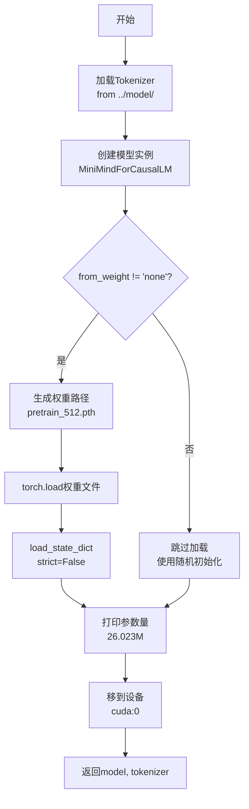

# 07 - 模型初始化详解（init_model函数）

## 一、模块概述

在 `train_full_sft.py` 的第146行，程序调用 `init_model()` 初始化模型：

```python
# Line 146
model, tokenizer = init_model(lm_config, args.from_weight, device=args.device)
```

**核心功能：**
1. 加载 **Tokenizer**（分词器）
2. 创建 **模型实例**（MiniMindForCausalLM）
3. 加载 **预训练权重**（可选）
4. 将模型移到指定设备（GPU/CPU）

---

## 二、init_model() 函数源码

### 2.1 完整代码

```python
# 文件：trainer/trainer_utils.py, Line 111-122
def init_model(lm_config, from_weight='pretrain', tokenizer_path='../model', save_dir='../out', device='cuda'):
    # 1. 加载分词器
    tokenizer = AutoTokenizer.from_pretrained(tokenizer_path)
    
    # 2. 创建模型实例
    model = MiniMindForCausalLM(lm_config)
    
    # 3. 加载预训练权重（可选）
    if from_weight != 'none':
        moe_suffix = '_moe' if lm_config.use_moe else ''
        weight_path = f'{save_dir}/{from_weight}_{lm_config.hidden_size}{moe_suffix}.pth'
        weights = torch.load(weight_path, map_location=device)
        model.load_state_dict(weights, strict=False)
    
    # 4. 打印参数量
    Logger(f'所加载Model可训练参数：{sum(p.numel() for p in model.parameters() if p.requires_grad) / 1e6:.3f} 百万')
    
    # 5. 移到设备
    return model.to(device), tokenizer
```

---

### 2.2 函数参数详解

| 参数 | 默认值 | 说明 | 来源 |
|------|--------|------|------|
| **lm_config** | - | 模型配置对象 | `MiniMindConfig` 实例 |
| **from_weight** | 'pretrain' | 权重名称 | 命令行 `--from_weight` |
| **tokenizer_path** | '../model' | 分词器路径 | 固定路径 |
| **save_dir** | '../out' | 权重保存目录 | 固定路径 |
| **device** | 'cuda' | 设备 | `args.device`（自动设置） |

**from_weight 的可选值：**

| 值 | 行为 | 说明 |
|----|------|------|
| **'none'** | 随机初始化 | 从头训练（不加载任何权重） |
| **'pretrain'** | 加载预训练权重 | 从预训练模型开始微调 |
| **'full_sft'** | 加载SFT权重 | 继续微调已微调的模型 |
| **自定义名称** | 加载指定权重 | 例如 'my_model' |

---

## 三、步骤1：加载分词器（Tokenizer）

### 3.1 代码详解

```python
# Line 113
tokenizer = AutoTokenizer.from_pretrained(tokenizer_path)
```

**AutoTokenizer 的作用：**
- 自动识别分词器类型（本项目使用Qwen分词器）
- 加载分词器配置和词表
- 提供统一的编码/解码接口

---

### 3.2 分词器文件结构

```bash
../model/
├── config.json              # 模型配置
├──tokenizer_config.json    # 分词器配置
├── tokenizer.json           # 词表和合并规则
├── special_tokens_map.json  # 特殊token映射
└── generation_config.json   # 生成配置
```

**关键文件说明：**

| 文件 | 作用 |
|------|------|
| **tokenizer.json** | BPE词表（6400个token） |
| **tokenizer_config.json** | 分词器类型、特殊token等配置 |
| **special_tokens_map.json** | 特殊token的文本表示 |

---

### 3.3 分词器核心方法

```python
# 编码（文本 → token IDs）
text = "你好，世界！"
input_ids = tokenizer(text).input_ids
# [151644, 108386, 99489, 151645]  # 示例

# 解码（token IDs → 文本）
decoded_text = tokenizer.decode(input_ids)
# "你好，world！"

# 批量编码
texts = ["文本1", "文本2"]
batch_ids = tokenizer(texts, padding=True, return_tensors='pt')
```

---

## 四、步骤2：创建模型实例

### 4.1 代码详解

```python
# Line 114
model = MiniMindForCausalLM(lm_config)
```

**MiniMindForCausalLM 架构：**
```python
MiniMindForCausalLM(
    config: MiniMindConfig(
        hidden_size=512,
        num_hidden_layers=8,
        num_attention_heads=8,
        num_key_value_heads=2,
        vocab_size=6400,
        ...
    )
)
```

**模型结构：**
```
MiniMindForCausalLM
├── model: MiniMindModel
│   ├── embed_tokens: Embedding(6400, 512)
│   ├── layers: ModuleList(8 layers)
│   │   └── TransformerBlock × 8
│   │       ├── attention: Attention (GQA)
│   │       ├── feed_forward: FeedForward (SwiGLU)
│   │       ├── attention_norm: RMSNorm
│   │       └── ffn_norm: RMSNorm
│   └── norm: RMSNorm
└── lm_head: Linear(512, 6400)  # 输出层
```

---

### 4.2 初始化状态

**随机初始化的权重：**
```python
# 所有权重使用PyTorch默认初始化
# nn.Linear: Xavier uniform
# nn.Embedding: normal(0, 1)
# nn.Parameter: 需手动初始化（如RoPE的freqs）
```

**参数量计算：**
```python
# 26M模型（hidden_size=512）
embed_params = 6400 * 512 = 3.3M
transformer_params = 8_layers * ~2.8M = 22.4M
output_params = 512 * 6400 = 3.3M
total = 3.3M + 22.4M + 3.3M ≈ 26M
```

---

## 五、步骤3：加载预训练权重

### 5.1 代码详解

```python
# Line 116-119
if from_weight != 'none':
    moe_suffix = '_moe' if lm_config.use_moe else ''
    weight_path = f'{save_dir}/{from_weight}_{lm_config.hidden_size}{moe_suffix}.pth'
    weights = torch.load(weight_path, map_location=device)
    model.load_state_dict(weights, strict=False)
```

**权重路径生成：**

| 配置 | from_weight | hidden_size | use_moe | 生成路径 |
|------|-------------|-------------|---------|----------|
| 标准512 | 'pretrain' | 512 | False | `../out/pretrain_512.pth` |
| MoE 512 | 'pretrain' | 512 | True | `../out/pretrain_512_moe.pth` |
| SFT 1024 | 'full_sft' | 1024 | False | `../out/full_sft_1024.pth` |

---

###5.2 为什么使用 `strict=False`？

```python
model.load_state_dict(weights, strict=False)
```

**strict 参数解释：**

| strict | 行为 | 使用场景 |
|--------|------|----------|
| **True** | 严格匹配，权重必须完全对应 | 加载完全相同的模型 |
| **False** | 允许部分匹配，忽略不匹配的键 | 迁移学习、微调 |

**使用 `strict=False` 的原因：**

```python
# 场景1：预训练 → SFT微调
# 预训练模型可能没有某些新增的参数（如特定的head）
预训练权重: {'model.layers.0.weight': ..., ...}
SFT模型:    {'model.layers.0.weight': ..., 'new_param': ...}
# strict=False 允许加载公共部分，忽略new_param

# 场景2：不同配置的模型
# 权重文件可能包含额外的参数（如优化器状态）
权重文件:  {'model.weight': ..., 'optimizer.state': ...}
模型:      {'model.weight': ...}
# strict=False 只加载模型部分，忽略optimizer
```

---

### 5.3 map_location 参数

```python
weights = torch.load(weight_path, map_location=device)
```

**作用：**
- 指定权重加载到哪个设备
- 避免权重加载到错误的设备

**示例：**
```python
# 权重保存在CPU上
# 加载到GPU:2
weights = torch.load('model.pth', map_location='cuda:2')

# 加载到CPU（用于调试）
weights = torch.load('model.pth', map_location='cpu')
```

---

## 六、步骤4：打印参数量

### 6.1 代码详解

```python
# Line 121
Logger(f'所加载Model可训练参数：{sum(p.numel() for p in model.parameters() if p.requires_grad) / 1e6:.3f} 百万')
```

**参数统计逻辑：**
```python
# 遍历所有参数
for param in model.parameters():
    # 仅统计可训练参数（requires_grad=True）
    if param.requires_grad:
        # param.numel() 返回参数总数
        total_params += param.numel()

# 转换为百万（M）
total_params_m = total_params / 1e6
```

**输出示例：**
```
所加载Model可训练参数：26.023 百万
```

---

### 6.2 参数冻结示例

```python
# 如果需要冻结部分参数（不常用）
for name, param in model.named_parameters():
    if 'embed' in name:  # 冻结Embedding层
        param.requires_grad = False

# 重新统计
trainable_params = sum(p.numel() for p in model.parameters() if p.requires_grad)
# 输出：22.7 百万（减去了Embedding的3.3M）
```

---

## 七、步骤5：移到设备

### 7.1 代码详解

```python
# Line 122
return model.to(device), tokenizer
```

**model.to(device) 的作用：**
-将所有模型参数和缓冲区（buffers）移到指定设备
- 支持 'cpu'、'cuda'、'cuda:0' 等

**设备选择：**
```python
# 在train_full_sft.py中，设备由分布式初始化决定
if dist.is_initialized():
    args.device = f"cuda:{local_rank}"
else:
    args.device = "cuda:0" if torch.cuda.is_available() else "cpu"
```

**关键点：**
```python
# ⚠️ 注意：tokenizer不需要移到设备
# tokenizer仅在CPU上运行（处理文本）
model = model.to(device)   # ✅ 模型移到GPU
tokenizer = tokenizer      # ✅ tokenizer留在CPU
```

---

## 八、完整执行流程

### 8.1 调用示例

```python
# 在train_full_sft.py Line 146
model, tokenizer = init_model(
    lm_config=lm_config,         # MiniMindConfig(hidden_size=512, ...)
    from_weight='pretrain',      # 从预训练权重开始
    device='cuda:0'              # GPU 0
)
```

**执行流程：**


---

### 8.2 不同场景的使用

**场景1：从预训练开始微调（推荐）**
```bash
python train_full_sft.py --from_weight pretrain
```

```python
# 加载: ../out/pretrain_512.pth
# 状态: 预训练权重 + 随机初始化的新参数（如有）
```

**场景2：从头训练（不推荐）**
```bash
python train_full_sft.py --from_weight none
```

```python
# 不加载任何权重
# 状态: 完全随机初始化
# ⚠️ 需要更长的训练时间，效果可能不如预训练
```

**场景3：继续微调已微调的模型**
```bash
python train_full_sft.py --from_weight full_sft
```

```python
# 加载: ../out/full_sft_512.pth
# 状态: 之前微调的权重
# 适用: 多阶段微调
```

---

## 九、常见问题

### Q1: 权重文件找不到怎么办？

**错误信息：**
```
FileNotFoundError: [Errno 2] No such file or directory: '../out/pretrain_512.pth'
```

**解决方案：**
1. **检查文件是否存在**：
   ```bash
   ls ../out/*.pth
   ```

2. **使用正确的权重名称**：
   ```bash
   # 查看可用权重
   ls ../out/
   # pretrain_512.pth, full_sft_512.pth, ...
   
   # 使用对应名称
   python train_full_sft.py --from_weight pretrain
   ```

3. **从头训练**：
   ```bash
   python train_full_sft.py --from_weight none
   ```

---

### Q2: strict=False会导致参数不匹配吗？

**回答：**

`strict=False` 会给出警告，告诉你哪些参数没有匹配：

```python
模型中的参数: ['model.layers.0.weight', 'model.layers.1.weight', 'new_head.weight']
权重文件中的参数: ['model.layers.0.weight', 'model.layers.1.weight']

# 加载结果：
✅ model.layers.0.weight: 成功加载
✅ model.layers.1.weight: 成功加载
⚠️ new_head.weight: 未找到，保持随机初始化

# PyTorch会打印警告：
# Warning: Some weights were not loaded: ['new_head.weight']
```

**这通常是正常的**，表示模型有新增的参数。

---

### Q3: 如何验证权重加载成功？

```python
# 方法1：检查权重值
print(model.model.layers[0].attention.q_proj.weight[0, :5])
# 应该是有意义的数值，不是全0或随机

# 方法2：对比加载前后
before = model.model.layers[0].attention.q_proj.weight.clone()
model.load_state_dict(weights, strict=False)
after = model.model.layers[0].attention.q_proj.weight
print(torch.allclose(before, after))  # False表示权重已更新

# 方法3：检查loss
# 预训练权重的初始loss应该已经较低（如2-3）
# 随机初始化的loss会很高（如8-10）
```

---

## 十、知识点总结

### 核心概念

| 概念 | 说明 |
|------|------|
| **Tokenizer** | 分词器，将文本转换为token IDs |
| **AutoTokenizer** | HuggingFace自动加载分词器的工具 |
| **MiniMindForCausalLM** | 因果语言模型（自回归生成） |
| **strict=False** | 允许部分权重加载（迁移学习） |
| **map_location** | 指定权重加载的设备 |
| **model.to(device)** | 将模型移到指定设备 |

### 关键代码

```python
# 初始化模型
model, tokenizer = init_model(lm_config, args.from_weight, device=args.device)

# 核心步骤
tokenizer = AutoTokenizer.from_pretrained(tokenizer_path)
model = MiniMindForCausalLM(lm_config)
weights = torch.load(weight_path, map_location=device)
model.load_state_dict(weights, strict=False)
model = model.to(device)
```

---

## 十一、下一步学习内容

在下一节中，我们将深入分析：

1. **SFTDataset 数据集实现**
   - JSONL数据格式
   - ChatML对话格式构建
   - Loss mask生成
   - Tokenization过程

---

**状态：** ✅ 已完成模型初始化深度分析
