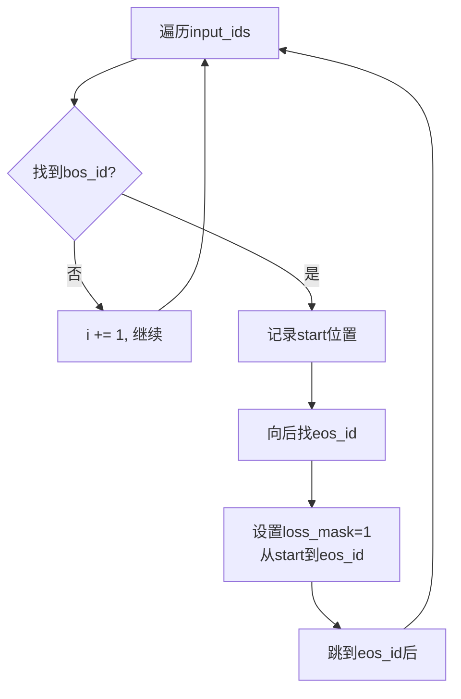
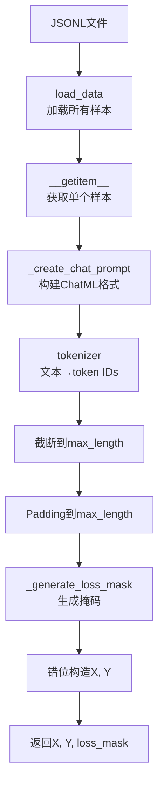

# 08 - SFT数据集详解（SFTDataset类）

## 一、模块概述

在 `train_full_sft.py` 的第147行，程序创建SFT数据集：

```python
# Line 147
train_ds = SFTDataset(args.data_path, tokenizer, max_length=args.max_seq_len)
```

**核心功能：**
1. 加载JSONL格式的SFT数据
2. 将对话转换为**ChatML格式**
3. Tokenize文本为token IDs
4. 生成**loss mask**（只计算assistant回复的损失）
5. 构造训练样本（X, Y, loss_mask）

---

## 二、什么是SFT（Supervised Fine-Tuning）？

### 2.1 SFT vs 预训练

| 阶段 | 数据格式 | 目标 | 示例 |
|------|---------|------|------|
| **预训练** | 纯文本 | 学习语言模式 | "今天天气很好。明天会下雨..." |
| **SFT** | 指令对话 | 学习遵循指令 | User: "介绍一下北京" <br> Assistant: "北京是..." |

### 2.2 SFT数据格式

**JSONL（JSON Lines）格式：**
```json
{"conversations": [{"role": "user", "content": "你好"}, {"role": "assistant", "content": "你好！有什么可以帮助你的？"}]}
{"conversations": [{"role": "user", "content": "介绍一下Python"}, {"role": "assistant", "content": "Python是一种..."}]}
```

每行一个JSON对象，包含一个完整的对话。

---

## 三、SFTDataset 类源码解析

### 3.1 类定义与初始化

```python
# 文件：dataset/lm_dataset.py, Line 49-56
class SFTDataset(Dataset):
    def __init__(self, jsonl_path, tokenizer, max_length=1024):
        super().__init__()
        self.tokenizer = tokenizer
        self.max_length = max_length
        self.samples = self.load_data(jsonl_path)
        self.bos_id = tokenizer(f'{tokenizer.bos_token}assistant', add_special_tokens=False).input_ids
        self.eos_id = tokenizer(f'{tokenizer.eos_token}', add_special_tokens=False).input_ids
```

**参数说明：**

| 参数 | 类型 | 说明 | 示例 |
|------|------|------|------|
| **jsonl_path** | str | 数据文件路径 | '../dataset/sft_mini_512.jsonl' |
| **tokenizer** | AutoTokenizer | 分词器 | Qwen tokenizer |
| **max_length** | int | 最大序列长度 | 340（默认） |

**关键属性：**

```python
# bos_id: Beginning of Sequence ID（assistant回复的开始标记）
# Qwen分词器：'<|im_start|>assistant' → [151644, ...]
self.bos_id = [151644, 77091]  # 示例

# eos_id: End of Sequence ID（回复结束标记）
# Qwen分词器：'<|im_end|>' → [151645]
self.eos_id = [151645]
```

**为什么需要bos_id和eos_id？**
- 用于生成**loss mask**，标识哪些位置需要计算损失
- 只计算assistant回复的损失，忽略user输入和系统提示

---

### 3.2 步骤1：加载数据

```python
# Line 61-67
def load_data(self, path):
    samples = []
    with open(path, 'r', encoding='utf-8') as f:
        for line_num, line in enumerate(f, 1):
            data = json.loads(line.strip())
            samples.append(data)
    return samples
```

**加载逻辑：**
```python
# 读取JSONL文件，每行一个JSON对象
# 文件内容：
# {"conversations": [...]}
# {"conversations": [...]}

# 返回：
[
    {"conversations": [{"role": "user", "content": "..."}, ...]},
    {"conversations": [{"role": "user", "content": "..."}, ...]},
    ...
]
```

---

### 3.3 步骤2：构建ChatML格式

```python
# Line 69-77
def _create_chat_prompt(self, cs):
    messages = cs.copy()
    tools = cs[0]["functions"] if (cs and cs[0]["role"] == "system" and cs[0].get("functions")) else None
    return self.tokenizer.apply_chat_template(
        messages,
        tokenize=False,
        add_generation_prompt=False,
        tools=tools
    )
```

**ChatML格式详解：**

ChatML（Chat Markup Language）是一种标准化的对话格式：

```text
<|im_start|>system
你是一个有用的助手。<|im_end|>
<|im_start|>user
介绍一下Python<|im_end|>
<|im_start|>assistant
Python是一种高级编程语言...<|im_end|>
```

**转换示例：**

```python
# 输入（conversations）
conversations = [
    {"role": "user", "content": "你好"},
    {"role": "assistant", "content": "你好！有什么可以帮助你的？"}
]

# 输出（ChatML格式）
"""
<|im_start|>user
你好<|im_end|>
<|im_start|>assistant
你好！有什么可以帮助你的？<|im_end|>
"""
```

**apply_chat_template 参数：**

| 参数 | 值 | 说明 |
|------|-----|------|
| **tokenize** | False | 返回文本，不进行tokenize |
| **add_generation_prompt** | False | 不添加生成提示（assistant已在对话中） |
| **tools** | None/tools | 工具调用配置（可选） |

---

### 3.4 步骤3：生成loss mask（核心）

```python
# Line 79-95
def _generate_loss_mask(self, input_ids):
    loss_mask = [0] * len(input_ids)  # 默认全0（不计算损失）
    i = 0
    while i < len(input_ids):
        # 找到 '<|im_start|>assistant' 的位置
        if input_ids[i:i + len(self.bos_id)] == self.bos_id:
            start = i + len(self.bos_id)
            end = start
            # 找到对应的 '<|im_end|>'
            while end < len(input_ids):
                if input_ids[end:end + len(self.eos_id)] == self.eos_id:
                    break
                end += 1
            # 将assistant回复部分的mask设为1
            for j in range(start + 1, min(end + len(self.eos_id) + 1, self.max_length)):
                loss_mask[j] = 1
            i = end + len(self.eos_id) if end < len(input_ids) else len(input_ids)
        else:
            i += 1
    return loss_mask
```

**核心逻辑：**



**示例：**

```python
# 输入文本（ChatML格式）
text = """
<|im_start|>user
你好<|im_end|>
<|im_start|>assistant
你好！<|im_end|>
"""

# Tokenize后的input_ids（简化示例）
input_ids = [
    151644, 872,      # <|im_start|>user
    108386,           # 你好
    151645,           # <|im_end|>
    151644, 77091,    # <|im_start|>assistant (bos_id)
    108386, 99489,    # 你好！
    151645            # <|im_end|> (eos_id)
]

# 生成的loss_mask
loss_mask = [
    0, 0,      # user标记
    0,         # 用户输入"你好"
    0,         # </im_end>
    0, 0,      # assistant标记
    1, 1,      # ✅ assistant回复"你好！"
    1          # ✅ </im_end>
]
```

**为什么这样设计？**
- **只监督assistant的回复**：user输入和系统提示不需要学习
- **避免过拟合**：模型不会记忆具体的user输入
- **提升效率**：减少无效的梯度计算

---

### 3.5 步骤4：构造训练样本

```python
# Line 97-119
def __getitem__(self, index):
    sample = self.samples[index]
    
    # 1. 构建ChatML格式对话
    prompt = self._create_chat_prompt(sample['conversations'])
    
    # 2. Tokenize并截断
    input_ids = self.tokenizer(prompt).input_ids[:self.max_length]
    
    # 3. Padding到max_length
    input_ids += [self.tokenizer.pad_token_id] * (self.max_length - len(input_ids))
    
    # 4. 生成loss mask
    loss_mask = self._generate_loss_mask(input_ids)
    
    # 5. 构建训练数据（错位）
    X = torch.tensor(input_ids[:-1], dtype=torch.long)     # 输入：前n-1个token
    Y = torch.tensor(input_ids[1:], dtype=torch.long)      # 标签：后n-1个token
    loss_mask = torch.tensor(loss_mask[1:], dtype=torch.long)  # 对齐Y
    
    return X, Y, loss_mask
```

**关键技术：错位（Causal Language Modeling）**

```python
# 原始序列
input_ids = [1, 2, 3, 4, 5, 6]

# 输入X（去掉最后一个）
X = [1, 2, 3, 4, 5]

# 标签Y（去掉第一个）
Y = [2, 3, 4, 5, 6]

# 训练时：
# 输入token 1 → 预测 token 2
# 输入token 2 → 预测 token 3
# ...
# 输入token 5 → 预测 token 6
```

**完整流程图：**



---

## 四、实际数据示例

### 4.1 JSONL原始数据

```json
{
  "conversations": [
    {"role": "user", "content": "介绍一下北京"},
    {"role": "assistant", "content": "北京是中国的首都，位于华北平原。"}
  ]
}
```

---

### 4.2 ChatML格式转换

```text
<|im_start|>user
介绍一下北京<|im_end|>
<|im_start|>assistant
北京是中国的首都，位于华北平原。<|im_end|>
```

---

### 4.3 Tokenization结果（简化）

```python
input_ids = [
    151644, 872,      # <|im_start|>user
    105135, 99489,    # 介绍一下
    107875,           # 北京
    151645,           # <|im_end|>
    151644, 77091,    # <|im_start|>assistant
    107875, 104725,   # 北京是
    100848, 9370,     # 中国的
    101935, 44293,    # 首都，
    101087, 111038,   # 位于华
    108197, 103060,   # 北平
    100323, 1773,     # 原。
    151645            # <|im_end|>
]
```

---

### 4.4 Loss Mask生成

```python
loss_mask = [
    0, 0,      # user标记
    0, 0,      # "介绍一下"
    0,         # "北京"
    0,         # </im_end>
    0, 0,      # assistant标记
    1, 1,      # ✅ "北京是"
    1, 1,      # ✅ "中国的"
    1, 1,      # ✅ "首都，"
    1, 1,      # ✅ "位于华"
    1, 1,      # ✅ "北平"
    1, 1,      # ✅ "原。"
    1          # ✅ </im_end>
]
```

---

### 4.5 训练样本

```python
# X（输入）= input_ids[:-1]
X = [151644, 872, 105135, 99489, 107875, 151645, 151644, 77091, 107875, 104725, 100848, ...]

# Y（标签）= input_ids[1:]
Y = [872, 105135, 99489, 107875, 151645, 151644, 77091, 107875, 104725, 100848, 9370, ...]

# loss_mask（对齐Y）= loss_mask[1:]
loss_mask = [0, 0, 0, 0, 0, 0, 0, 1, 1, 1, 1, ...]
```

**训练时的损失计算：**
```python
# 在train_epoch()中
loss = loss_fct(logits, Y).view(Y.size())  # 计算每个位置的损失
loss = (loss * loss_mask).sum() / loss_mask.sum()  # 只计算mask=1的位置
```

---

## 五、DataLoader集成

### 5.1 创建DataLoader

```python
# 在train_full_sft.py中
train_ds = SFTDataset(args.data_path, tokenizer, max_length=args.max_seq_len)
train_sampler = DistributedSampler(train_ds) if dist.is_initialized() else None

loader = DataLoader(
    train_ds,
    batch_size=args.batch_size,
    shuffle=(train_sampler is None),
    sampler=train_sampler,
    num_workers=args.num_workers,
    pin_memory=True
)
```

---

### 5.2 训练循环中的使用

```python
# train_epoch() 函数
for step, (X, Y, loss_mask) in enumerate(loader):
    X = X.to(args.device)          # [batch, seq_len-1]
    Y = Y.to(args.device)          # [batch, seq_len-1]
    loss_mask = loss_mask.to(args.device)  # [batch, seq_len-1]
    
    # 前向传播
    res = model(X)  # res.logits: [batch, seq_len-1, vocab_size]
    
    # 损失计算
    loss = loss_fct(res.logits.view(-1, vocab_size), Y.view(-1))
    loss = loss.view(Y.size())
    loss = (loss * loss_mask).sum() / loss_mask.sum()  # 只计算assistant回复
```

---

## 六、与预训练数据集对比

| 特性 | PretrainDataset | SFTDataset |
|------|----------------|------------|
| **数据格式** | 纯文本 | JSONL对话 |
| **格式化** | 无 | ChatML格式 |
| **Loss Mask** | 全1（所有token） | 仅assistant回复 |
| **目标** | 语言建模 | 指令遵循 |
| **训练难度** | 简单 | 较复杂 |

**PretrainDataset示例：**
```python
# 输入：纯文本
text = "今天天气很好。明天会下雨。"

# 输出：
X = [1, 2, 3, 4, 5, 6, 7]
Y = [2, 3, 4, 5, 6, 7, 8]
loss_mask = [1, 1, 1, 1, 1, 1, 1]  # 全部计算损失
```

---

## 七、常见问题

### Q1: 为什么max_length默认是340而不是512？

**回答：**

```python
# 命令行参数
parser.add_argument('--max_seq_len', default=340, type=int, 
                    help="训练的最大截断长度（中文1token≈1.5~1.7字符）")
```

**原因：**
1. **平衡性能与显存**：340对于大部分SFT对话已足够
2. **中文特性**：1个token ≈ 1.5个汉字，340 tokens ≈ 510个汉字
3. **效率考虑**：序列越长，显存占用和计算时间越多

**如何调整：**
```bash
# 增加到512
python train_full_sft.py --max_seq_len 512

# 适用于长对话
python train_full_sft.py --max_seq_len 1024
```

---

### Q2: loss_mask全为0会怎样？

**问题场景：**
```python
# 如果数据中没有assistant回复
conversations = [
    {"role": "user", "content": "你好"}
    # 缺少assistant回复
]

# loss_mask全为0
loss_mask = [0, 0, 0, 0, 0, ...]
```

**结果：**
```python
loss = (loss * loss_mask).sum() / loss_mask.sum()
# = (... * 0).sum() / 0
# = 0 / 0
# = NaN（除以0错误）
```

**解决方案：**
- 确保每个对话都有assistant回复
- 或在损失计算时添加epsilon：
  ```python
  loss = (loss * loss_mask).sum() / (loss_mask.sum() + 1e-8)
  ```

---

### Q3: 如何添加系统提示（system prompt）？

**示例数据：**
```json
{
  "conversations": [
    {"role": "system", "content": "你是一个有用的助手。"},
    {"role": "user", "content": "你好"},
    {"role": "assistant", "content": "你好！有什么可以帮助你的？"}
  ]
}
```

**生成的ChatML：**
```text
<|im_start|>system
你是一个有用的助手。<|im_end|>
<|im_start|>user
你好<|im_end|>
<|im_start|>assistant
你好！有什么可以帮助你的？<|im_end|>
```

**loss_mask：**
```python
# system和user部分：mask=0
# assistant部分：mask=1
```

---

## 八、知识点总结

### 核心概念

| 概念 | 说明 |
|------|------|
| **SFT** | Supervised Fine-Tuning，监督微调 |
| **JSONL** | JSON Lines，每行一个JSON对象 |
| **ChatML** | Chat Markup Language，对话标记语言 |
| **loss mask** | 损失掩码，控制哪些位置计算损失 |
| **Causal LM** | 因果语言模型，预测下一个token |
| **bos_id/eos_id** | 开始/结束标记的token IDs |

### 关键代码

```python
# 创建SFT数据集
train_ds = SFTDataset(args.data_path, tokenizer, max_length=args.max_seq_len)

# 核心方法
prompt = self._create_chat_prompt(conversations)  # ChatML格式
input_ids = self.tokenizer(prompt).input_ids
loss_mask = self._generate_loss_mask(input_ids)  # 只监督assistant
X, Y = input_ids[:-1], input_ids[1:]  # 错位构造
```

### 设计亮点

1. ✅ **只监督assistant回复**：提高训练效率
2. ✅ **ChatML标准格式**：与主流LLM一致
3. ✅ **动态loss mask**：支持多轮对话
4. ✅ **灵活的max_length**：平衡性能与显存

---

## 九、下一步学习内容

在下一节中，我们将深入分析：

1. **DistributedSampler 分布式采样器**
   - 数据分片原理
   - shuffle机制
   - epoch同步

2. **AdamW 优化器配置**
   - AdamW vs Adam
   - 学习率设置
   - 权重衰减

---

**状态：** ✅ 已完成 SFT数据集深度分析
