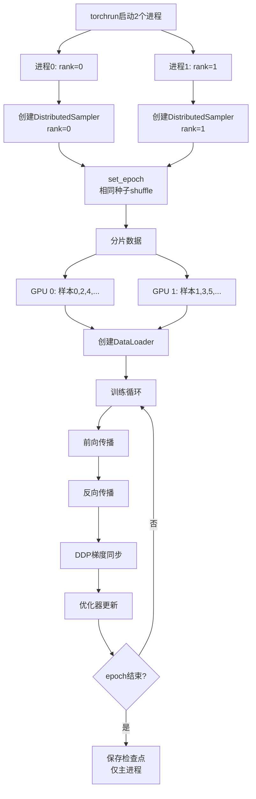

# 09 - 分布式采样与AdamW优化器详解

## 一、模块概述

在 `train_full_sft.py` 的第148-150行，程序配置了数据采样器和优化器：

```python
# Line 148-150
train_sampler = DistributedSampler(train_ds) if dist.is_initialized() else None
scaler = torch.cuda.amp.GradScaler(enabled=(args.dtype == 'float16'))
optimizer = optim.AdamW(model.parameters(), lr=args.learning_rate)
```

**核心功能：**
1. **DistributedSampler**：多GPU训练时分片数据
2. **GradScaler**：混合精度梯度缩放（已在文档05讲解）
3. **AdamW**：优化器，更新模型参数

本文重点讲解：DistributedSampler 和 AdamW。

---

## 二、DistributedSampler 详解

### 2.1 为什么需要DistributedSampler？

**问题场景：多GPU训练**

```python
# 错误做法：不使用DistributedSampler
loader = DataLoader(train_ds, batch_size=16, shuffle=True)

# 结果：
# GPU 0: 处理 [样本0, 样本1, 样本2, ...]
# GPU 1: 处理 [样本0, 样本1, 样本2, ...]  ❌ 数据重复！
# 所有GPU处理相同的数据
```

**正确做法：使用DistributedSampler**

```python
sampler = DistributedSampler(train_ds)
loader = DataLoader(train_ds, batch_size=16, sampler=sampler)

# 结果：
# GPU 0: 处理 [样本0, 样本2, 样本4, ...]
# GPU 1: 处理 [样本1, 样本3, 样本5, ...]  ✅ 数据分片！
# 每个GPU处理不同的数据
```

---

### 2.2 代码详解

```python
# Line 148
train_sampler = DistributedSampler(train_ds) if dist.is_initialized() else None
```

**条件判断：**

| 条件 | train_sampler | 说明 |
|------|--------------|------|
| **dist.is_initialized() = True** | DistributedSampler | 多GPU模式 |
| **dist.is_initialized() = False** | None | 单GPU/CPU模式 |

**后续使用：**

```python
# Line 164-165（训练循环中）
loader = DataLoader(
    train_ds,
    batch_size=args.batch_size,
    shuffle=(train_sampler is None),  # sampler存在时不能shuffle
    sampler=train_sampler,
    num_workers=args.num_workers,
    pin_memory=True
)
```

**关键规则：**
- **sampler和shuffle互斥**：使用sampler时，shuffle必须为False
- **单GPU时**：sampler=None，shuffle=True
- **多GPU时**：sampler=DistributedSampler，shuffle=False

---

### 2.3 DistributedSampler 工作原理

#### 核心逻辑（简化版）

```python
class DistributedSampler:
    def __init__(self, dataset, shuffle=True):
        self.dataset = dataset
        self.num_replicas = dist.get_world_size()  # GPU数量
        self.rank = dist.get_rank()                # 当前GPU编号
        self.epoch = 0
        self.shuffle = shuffle
        
        # 每个GPU处理的样本数（向上取整）
        self.num_samples = math.ceil(len(dataset) / self.num_replicas)
        self.total_size = self.num_samples * self.num_replicas
    
    def set_epoch(self, epoch):
        self.epoch = epoch  # 每个epoch更新，改变shuffle顺序
    
    def __iter__(self):
        # 1. 生成全局索引
        if self.shuffle:
            g = torch.Generator()
            g.manual_seed(self.epoch)  # 使用epoch作为种子
            indices = torch.randperm(len(self.dataset), generator=g).tolist()
        else:
            indices = list(range(len(self.dataset)))
        
        # 2. Padding（确保每个GPU样本数相同）
        indices += indices[:(self.total_size - len(indices))]
        
        # 3. 分片：每个GPU取属于自己的部分
        indices = indices[self.rank:self.total_size:self.num_replicas]
        
        return iter(indices)
```

---

#### 分片示例

**假设：**
- 数据集大小：10个样本 [0, 1, 2, 3, 4, 5, 6, 7, 8, 9]
- GPU数量：3
- shuffle=True, epoch=0

**步骤1：Shuffle（所有GPU使用相同种子）**
```python
g.manual_seed(epoch)  # epoch=0
indices = torch.randperm(10, generator=g).tolist()
# 例如：[3, 7, 1, 9, 0, 5, 2, 8, 4, 6]
```

**步骤2：Padding（确保能整除GPU数量）**
```python
num_samples = ceil(10 / 3) = 4  # 每个GPU处理4个样本
total_size = 4 * 3 = 12

# Padding 2个样本
indices += indices[:2]
# [3, 7, 1, 9, 0, 5, 2, 8, 4, 6, 3, 7]
```

**步骤3：分片（每个GPU取自己的部分）**
```python
# GPU 0 (rank=0): indices[0::3]
[3, 9, 2, 6]

# GPU 1 (rank=1): indices[1::3]
[7, 0, 8, 3]

# GPU 2 (rank=2): indices[2::3]
[1, 5, 4, 7]
```

**验证：**
- ✅ 每个GPU处理4个样本（相同）
- ✅ 没有重复（除了padding的样本）
- ✅ 覆盖所有原始样本

---

### 2.4 set_epoch() 的作用

```python
# Line 157（训练循环中）
for epoch in range(start_epoch, args.epochs):
    train_sampler and train_sampler.set_epoch(epoch)  # ← 关键！
    ...
```

**为什么每个epoch都要调用？**

```python
# Epoch 0
g.manual_seed(0)
indices = [3, 7, 1, 9, 0, 5, 2, 8, 4, 6]

# Epoch 1（如果不调用set_epoch）
g.manual_seed(0)  # ❌ 种子相同！
indices = [3, 7, 1, 9, 0, 5, 2, 8, 4, 6]  # 顺序完全相同

# Epoch 1（调用set_epoch(1)）
g.manual_seed(1)  # ✅ 种子不同
indices = [5, 2, 9, 1, 7, 0, 8, 3, 6, 4]  # 顺序不同
```

**效果：**
- 每个epoch的数据顺序不同
- 提高训练效果（避免过拟合固定顺序）

---

### 2.5 完整流程图

```mermaid
graph TD
    A[开始新epoch] --> B[train_sampler.set_epoch]
    B --> C[生成全局shuffle<br/>所有GPU相同种子]
    C --> D[Padding到total_size]
    D --> E{分片}
    E -->|rank=0| F[GPU 0取indices[0::3]]
    E -->|rank=1| G[GPU 1取indices[1::3]]
    E -->|rank=2| H[GPU 2取indices[2::3]]
    F --> I[创建DataLoader]
    G --> I
    H --> I
    I --> J[开始训练]
```

---

## 三、AdamW 优化器详解

### 3.1 代码详解

```python
# Line 150
optimizer = optim.AdamW(model.parameters(), lr=args.learning_rate)
```

**参数说明：**

| 参数 | 值 | 说明 |
|------|-----|------|
| **parameters** | model.parameters() | 所有可训练参数 |
| **lr** | 5e-7（默认） | 学习率 |

**学习率参数定义：**
```python
# Line 91
parser.add_argument("--learning_rate", type=float, default=5e-7, 
                    help="初始学习率")
```

---

### 3.2 AdamW vs Adam

#### Adam 优化器公式

```python
# Adam更新规则
m_t = β1 * m_{t-1} + (1-β1) * g_t        # 一阶动量（梯度的指数移动平均）
v_t = β2 * v_{t-1} + (1-β2) * g_t^2      # 二阶动量（梯度平方的指数移动平均）
m_hat = m_t / (1 - β1^t)                  # 偏差修正
v_hat = v_t / (1 - β2^t)
θ_t = θ_{t-1} - lr * m_hat / (sqrt(v_hat) + ε)  # 参数更新
```

#### AdamW 优化器公式

```python
# AdamW: Adam + 权重衰减（Weight Decay）
m_t = β1 * m_{t-1} + (1-β1) * g_t
v_t = β2 * v_{t-1} + (1-β2) * g_t^2
m_hat = m_t / (1 - β1^t)
v_hat = v_t / (1 - β2^t)
θ_t = θ_{t-1} - lr * m_hat / (sqrt(v_hat) + ε) - lr * λ * θ_{t-1}  # ← 额外的权重衰减
```

---

#### 关键区别

| 特性 | Adam | AdamW |
|------|------|-------|
| **权重衰减** | 加在梯度上（L2正则） | 直接作用于参数 |
| **公式** | `g_t += λ * θ_{t-1}` | `θ_t -= lr * λ * θ_{t-1}` |
| **效果** | 与学习率耦合 | 解耦学习率和正则化 |
| **推荐** | 一般场景 | **Transformer模型**（更稳定） |

**为什么AdamW更好？**

```python
# Adam: 权重衰减受学习率影响
# lr=0.001, λ=0.01
θ_new = θ - 0.001 * (gradient + 0.01 * θ)
#         ↑ 学习率影响衰减强度

# AdamW: 权重衰减独立
θ_new = θ - 0.001 * gradient - 0.001 * 0.01 * θ
#         ↑ 梯度更新    ↑ 独立的权重衰减
```

---

### 3.3 默认参数

```python
# PyTorch AdamW默认参数
optimizer = optim.AdamW(
    params=model.parameters(),
    lr=5e-7,              # 学习率
    betas=(0.9, 0.999),   # β1, β2（动量系数）
    eps=1e-08,            # ε（数值稳定性）
    weight_decay=0.01,    # λ（权重衰减）
    amsgrad=False         # 是否使用AMSGrad变体
)
```

---

### 3.4 学习率调度

**Cosine学习率衰减：**

```python
# Line 30（train_epoch函数中）
lr = get_lr(epoch * iters + step, args.epochs * iters, args.learning_rate)
for param_group in optimizer.param_groups:
    param_group['lr'] = lr
```

**get_lr() 函数：**
```python
# trainer_utils.py, Line 25-26
def get_lr(current_step, total_steps, lr):
    return lr * (0.1 + 0.45 * (1 + math.cos(math.pi * current_step / total_steps)))
```

**公式解析：**
```python
# Cosine衰减公式
lr_t = lr_initial * (0.1 + 0.45 * (1 + cos(π * t / T)))

# 分解：
# 1. cos(π * t / T): 从1衰减到-1
# 2. (1 + cos(...)): 从2衰减到0
# 3. 0.45 * (...): 从0.9衰减到0
# 4. 0.1 + ...: 从1.0衰减到0.1

# 最终：lr_t 从 lr_initial 衰减到 0.1 * lr_initial
```

**学习率曲线：**
```
lr
 ↑
1.0| *
0.9|  *
0.8|   *
0.7|    **
0.6|      **
0.5|        ***
0.4|           ****
0.3|               ****
0.2|                    *****
0.1|                          ******____
   |_________________________________→ step
   0         total_steps/2      total_steps
```

**优势：**
- 训练初期：学习率高，快速收敛
- 训练后期：学习率低，精细调整
- 平滑过渡：避免学习率突变

---

### 3.5 优化器状态

**state_dict() 内容：**
```python
optimizer.state_dict()
{
    'state': {
        0: {  # 第0个参数
            'step': 1000,                    # 训练步数
            'exp_avg': tensor([...]),        # m_t（一阶动量）
            'exp_avg_sq': tensor([...])      # v_t（二阶动量）
        },
        1: {...},  # 第1个参数
        ...
    },
    'param_groups': [
        {
            'lr': 5e-7,
            'betas': (0.9, 0.999),
            'eps': 1e-08,
            'weight_decay': 0.01,
            'amsgrad': False,
            'params': [0, 1, 2, ...]  # 参数ID列表
        }
    ]
}
```

**为什么需要保存优化器状态？**
- **动量延续**：恢复训练时，动量信息不丢失
- **学习率恢复**：保持学习率调度的连续性
- **训练稳定性**：避免训练曲线突变

---

## 四、完整的训练配置

### 4.1 步骤5完整代码

```python
# Line 140-150
# ========== 5. 定义模型、数据集、优化器 ==========
## 初始化模型
model, tokenizer = init_model(lm_config, args.from_weight, device=args.device)

## 创建SFT数据集（指令微调格式）
train_ds = SFTDataset(args.data_path, tokenizer, max_length=args.max_seq_len)

## 创建分布式采样器（确保数据不重复）
train_sampler = DistributedSampler(train_ds) if dist.is_initialized() else None

## 创建梯度缩放器（混合精度训练必需）
scaler = torch.cuda.amp.GradScaler(enabled=(args.dtype == 'float16'))

## 创建AdamW优化器
optimizer = optim.AdamW(model.parameters(), lr=args.learning_rate)
```

---

### 4.2 训练循环中的使用

```python
# Line 156-165
for epoch in range(start_epoch, args.epochs):
    # 1. 更新采样器epoch（改变shuffle顺序）
    train_sampler and train_sampler.set_epoch(epoch)
    
    # 2. 创建DataLoader
    loader = DataLoader(
        train_ds,
        batch_size=args.batch_size,
        shuffle=(train_sampler is None),
        sampler=train_sampler,
        num_workers=args.num_workers,
        pin_memory=True
    )
    
    # 3. 开始训练
    train_epoch(epoch, loader, len(loader), 0, wandb)
```

---

### 4.3 训练步骤中的优化器使用

```python
# Line 30-54（train_epoch函数）
for step, (X, Y, loss_mask) in enumerate(loader):
    # 1. 动态调整学习率
    lr = get_lr(epoch * iters + step, args.epochs * iters, args.learning_rate)
    for param_group in optimizer.param_groups:
        param_group['lr'] = lr
    
    # 2. 前向传播
    with autocast_ctx:
        res = model(X)
        loss = ...
    
    # 3. 反向传播
    scaler.scale(loss).backward()
    
    # 4. 梯度累积后更新
    if (step + 1) % args.accumulation_steps == 0:
        scaler.unscale_(optimizer)
        torch.nn.utils.clip_grad_norm_(model.parameters(), args.grad_clip)
        
        scaler.step(optimizer)  # ← 更新参数
        scaler.update()
        
        optimizer.zero_grad(set_to_none=True)  # ← 清空梯度
```

---

## 五、多GPU训练完整流程

### 5.1 流程图



---

### 5.2 实际示例

**命令：**
```bash
CUDA_VISIBLE_DEVICES=0,1 torchrun --nproc_per_node 2 train_full_sft.py \
  --batch_size 16 \
  --epochs 2
```

**执行过程：**

```python
# 进程0（GPU 0）
local_rank = 0
dist.get_rank() = 0
dist.get_world_size() = 2

train_sampler = DistributedSampler(train_ds)
# sampler.rank = 0
# sampler.num_replicas = 2

train_sampler.set_epoch(0)
# 生成indices: [3, 7, 1, 9, 0, 5, 2, 8, 4, 6]
# GPU 0处理: [3, 9, 2, 6, ...]

loader = DataLoader(train_ds, batch_size=16, sampler=train_sampler)
# GPU 0每次取16个样本（来自自己的分片）

# ---

# 进程1（GPU 1）
local_rank = 1
dist.get_rank() = 1
dist.get_world_size() = 2

train_sampler = DistributedSampler(train_ds)
# sampler.rank = 1
# sampler.num_replicas = 2

train_sampler.set_epoch(0)
# 生成相同的indices: [3, 7, 1, 9, 0, 5, 2, 8, 4, 6]
# GPU 1处理: [7, 0, 8, 3, ...]

loader = DataLoader(train_ds, batch_size=16, sampler=train_sampler)
# GPU 1每次取16个样本（来自自己的分片）
```

---

## 六、常见问题

### Q1: 为什么不能同时使用sampler和shuffle？

**错误代码：**
```python
loader = DataLoader(
    train_ds,
    batch_size=16,
    shuffle=True,        # ❌
    sampler=train_sampler  # ❌
)
```

**错误信息：**
```
ValueError: sampler option is mutually exclusive with shuffle
```

**原因：**
- **shuffle**：DataLoader内部随机打乱数据
- **sampler**：提供自定义的采样顺序
- 两者功能冲突，只能选其一

**正确做法：**
```python
# 使用sampler（多GPU）
loader = DataLoader(train_ds, batch_size=16, sampler=train_sampler)

# 使用shuffle（单GPU）
loader = DataLoader(train_ds, batch_size=16, shuffle=True)
```

---

### Q2: 忘记调用set_epoch会怎样？

**问题代码：**
```python
for epoch in range(args.epochs):
    # train_sampler.set_epoch(epoch)  # ❌ 忘记调用
    loader = DataLoader(train_ds, sampler=train_sampler)
    ...
```

**结果：**
- 每个epoch的数据顺序完全相同
- 模型可能过拟合这个固定顺序
- 训练效果下降

**解决：**
```python
for epoch in range(args.epochs):
    train_sampler and train_sampler.set_epoch(epoch)  # ✅
    loader = DataLoader(train_ds, sampler=train_sampler)
```

---

### Q3: 学习率太大或太小怎么办？

**学习率太大（lr > 1e-4）：**
```
loss: 8.234567
loss: NaN  ← 梯度爆炸
```

**学习率太小（lr < 1e-8）：**
```
loss: 3.456789
loss: 3.456788  ← 几乎不变
```

**推荐设置：**

| 模型大小 | 预训练 | SFT |
|---------|--------|-----|
| **26M** | 5e-4 | 5e-7 |
| **52M** | 3e-4 | 3e-7 |
| **104M** | 1e-4 | 1e-7 |

**经验法则：**
- SFT学习率 = 预训练学习率 / 1000
- 从小开始，逐步增大
- 观察loss曲线调整

---

## 七、知识点总结

### 核心概念

| 概念 | 说明 |
|------|------|
| **DistributedSampler** | 多GPU数据分片采样器 |
| **set_epoch()** | 更新shuffle种子，每个epoch不同顺序 |
| **AdamW** | Adam + 解耦权重衰减 |
| **Cosine学习率** | 余弦衰减学习率调度 |
| **一阶动量** | 梯度的指数移动平均（m_t） |
| **二阶动量** | 梯度平方的指数移动平均（v_t） |

### 关键代码

```python
# 分布式采样器
train_sampler = DistributedSampler(train_ds) if dist.is_initialized() else None

# AdamW优化器
optimizer = optim.AdamW(model.parameters(), lr=args.learning_rate)

# 训练循环
for epoch in range(args.epochs):
    train_sampler and train_sampler.set_epoch(epoch)  # 更新epoch
    
    # 动态学习率
    lr = get_lr(current_step, total_steps, lr_initial)
    for param_group in optimizer.param_groups:
        param_group['lr'] = lr
    
    # 优化器更新
    scaler.step(optimizer)
    optimizer.zero_grad()
```

### 设计亮点

1. ✅ **数据分片**：多GPU无重复处理
2. ✅ **动态shuffle**：每个epoch顺序不同
3. ✅ **解耦权重衰减**：AdamW更稳定
4. ✅ **Cosine衰减**：平滑的学习率调整

---

## 八、步骤5总结

我们已经完整讲解了步骤5的所有组件：

| 组件 | 文档 | 核心内容 |
|------|------|---------|
| **init_model()** | 文档07 | Tokenizer、模型实例、权重加载 |
| **SFTDataset** | 文档08 | ChatML格式、loss mask、错位构造 |
| **DistributedSampler** | 文档09 | 数据分片、shuffle机制 |
| **AdamW** | 文档09 | 优化器、学习率调度 |

**下一步学习内容：**

步骤7：**分布式训练包装（DDP）**
- DDP原理与梯度同步
- `_ddp_params_and_buffers_to_ignore`
- 多GPU通信机制

---

**状态：** ✅ 已完成步骤5的所有模块深度分析
