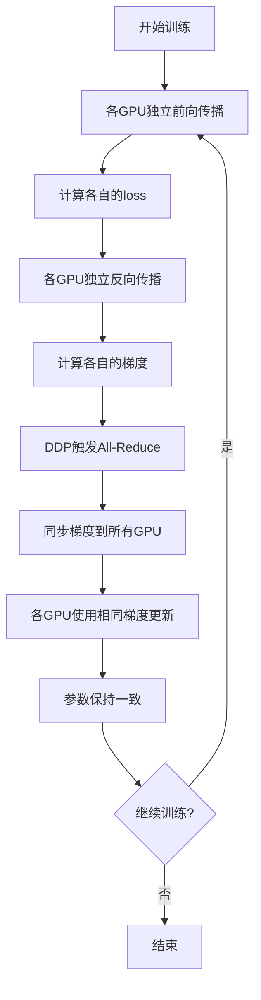

# 10 - DDP分布式训练包装详解

## 一、模块概述

在 `train_full_sft.py` 的第162-165行，程序使用DDP包装模型：

```python
# Line 162-165
# ========== 7. DDP包模型；分布式数据并行包装 ==========
## 使用DDP包装模型（多GPU训练核心）
## 忽略旋转位置编码参数（RoPE、无需同步）
if dist.is_initialized():
    model._ddp_params_and_buffers_to_ignore = {"freqs_cos", "freqs_sin"}
    model = DistributedDataParallel(model, device_ids=[local_rank])
```

**核心功能：**
1. 将单GPU模型包装为支持**多GPU并行训练**的DDP模型
2. 指定哪些参数**不需要梯度同步**
3. 自动处理**梯度聚合**（All-Reduce）

---

## 二、什么是DDP？

### 2.1 DDP 全称与定义

**DDP（DistributedDataParallel）：**
- PyTorch的分布式数据并行训练工具
- 支持单机多卡、多机多卡训练
- 自动进行梯度同步和参数更新

---

### 2.2 单GPU vs 多GPU（DDP）

#### 单GPU训练流程

```python
# 单GPU
model = Model().cuda()
optimizer = Adam(model.parameters())

for X, Y in loader:
    loss = model(X)
    loss.backward()
    optimizer.step()
```

**特点：**
- 简单直接
- batch_size受限于单卡显存
- 训练速度慢

---

#### 多GPU（DDP）训练流程

```python
# 多GPU（2卡）
model = Model().cuda(local_rank)
model = DistributedDataParallel(model, device_ids=[local_rank])
optimizer = Adam(model.parameters())

for X, Y in loader:  # 每个GPU处理不同的数据
    loss = model(X)   # GPU 0: batch 0-15, GPU 1: batch 16-31
    loss.backward()   # 各自反向传播
    # DDP自动同步梯度（All-Reduce）
    optimizer.step()  # 所有GPU使用相同的梯度更新
```

**特点：**
- 有效batch_size = 单卡batch × GPU数
- 训练速度线性提升（理论上）
- 需要额外的通信开销

---

### 2.3 DDP vs DP（DataParallel）

| 特性 | DP（DataParallel） | DDP（DistributedDataParallel） |
|------|-------------------|-------------------------------|
| **进程模型** | 单进程多线程 | 多进程 |
| **通信方式** | 主GPU聚合 | All-Reduce（点对点） |
| **负载均衡** | 主GPU负载高 | 所有GPU负载均衡 |
| **性能** | 较慢 | 快（推荐） |
| **适用场景** | 调试 | 生产训练 |

**为什么DDP更好？**
```python
# DP: 主GPU成为瓶颈
GPU 0: 负载100%（收集梯度、更新参数、分发）
GPU 1: 负载70%（只计算梯度）
GPU 2: 负载70%
GPU 3: 负载70%

# DDP: 负载均衡
GPU 0: 负载90%（All-Reduce通信）
GPU 1: 负载90%
GPU 2: 负载90%
GPU 3: 负载90%
```

---

## 三、代码详解

### 3.1 条件判断

```python
# Line 162
if dist.is_initialized():
```

**判断是否启用分布式：**

| 条件 | 行为 | 说明 |
|------|------|------|
| **dist.is_initialized() = True** | 包装为DDP | 多GPU训练 |
| **dist.is_initialized() = False** | 不包装 | 单GPU/CPU训练 |

**何时为True？**
- 使用 `torchrun` 启动
- 成功调用了 `dist.init_process_group()`

---

### 3.2 设置忽略参数

```python
# Line 163
model._ddp_params_and_buffers_to_ignore = {"freqs_cos", "freqs_sin"}
```

**为什么要忽略这些参数？**

#### RoPE位置编码参数

```python
# 在MiniMind模型中，RoPE参数定义为buffer（不是可训练参数）
class MiniMindModel(nn.Module):
    def __init__(self, config):
        ...
        # 预计算的RoPE频率
        freqs_cos, freqs_sin = precompute_freqs_cis(...)
        self.register_buffer("freqs_cos", freqs_cos)
        self.register_buffer("freqs_sin", freqs_sin)
```

**register_buffer 的作用：**
- 注册为模型状态的一部分
- 会随模型保存和加载
- **不是可训练参数**（requires_grad=False）
- 会被包含在 `model.state_dict()` 中

**DDP的默认行为：**
```python
# DDP会同步所有参数和buffer
# 包括：
# 1. 可训练参数（requires_grad=True）
# 2. buffer（如freqs_cos, freqs_sin）
```

**为什么忽略RoPE参数？**

1. **不需要同步**：
   ```python
   # freqs_cos和freqs_sin在所有GPU上完全相同
   # 因为它们是固定的预计算值，不会改变
   # 同步它们浪费通信带宽
   ```

2. **节省通信开销**：
   ```python
   # freqs_cos: [32768, 32] → 约4MB（float32）
   # freqs_sin: [32768, 32] → 约4MB
   # 总计：8MB的无用通信
   ```

3. **提高训练速度**：
   ```python
   # 减少通信量 → 减少通信时间 → 训练更快
   ```

---

### 3.3 DDP包装

```python
# Line 164
model = DistributedDataParallel(model, device_ids=[local_rank])
```

**DistributedDataParallel 参数：**

| 参数 | 值 | 说明 |
|------|-----|------|
| **module** | model | 要包装的模型 |
| **device_ids** | [local_rank] | 模型所在的GPU |
| **output_device** | None（默认device_ids[0]） | 输出设备 |
| **broadcast_buffers** | True（默认） | 是否广播buffer |
| **find_unused_parameters** | False（默认） | 是否检查未使用的参数 |

**包装后的模型结构：**
```python
# 包装前
model = MiniMindForCausalLM(...)

# 包装后
model = DistributedDataParallel(
    module=MiniMindForCausalLM(...),  # 原始模型在这里
    device_ids=[local_rank],
    ...
)

# 访问原始模型
model.module  # → MiniMindForCausalLM
```

---

## 四、DDP工作原理

### 4.1 完整训练流程



---

### 4.2 All-Reduce 梯度同步

**什么是All-Reduce？**
- 分布式通信原语
- 将所有GPU的梯度求**平均**
- 结果广播到所有GPU

**示例：**
```python
# 假设：2个GPU，某个参数的梯度

# 反向传播后（各GPU独立计算）
GPU 0: grad = [1.0, 2.0, 3.0]
GPU 1: grad = [3.0, 2.0, 1.0]

# All-Reduce: 求平均
all_reduce_avg = ([1.0+3.0]/2, [2.0+2.0]/2, [3.0+1.0]/2)
               = [2.0, 2.0, 2.0]

# 同步后（所有GPU相同）
GPU 0: grad = [2.0, 2.0, 2.0]
GPU 1: grad = [2.0, 2.0, 2.0]

# 参数更新（所有GPU相同）
param = param - lr * grad
```

---

### 4.3 通信机制（NCCL）

**NCCL（NVIDIA Collective Communications Library）：**
- 专为GPU设计的通信库
- 支持高速GPU间通信（NVLink、PCIe）
- 优化的All-Reduce实现

**通信拓扑（环形All-Reduce）：**
```
# 2 GPU环形
GPU 0 ←→ GPU 1

# 4 GPU环形
GPU 0 → GPU 1
  ↑       ↓
GPU 3 ← GPU 2

# 通信步骤：
1. Reduce-Scatter: 分段求和
2. All-Gather: 收集所有段
```

**通信带宽影响：**
```python
# NVLink（推荐）
通信速度：300 GB/s
适用：同一服务器内的GPU

# PCIe 4.0
通信速度：32 GB/s
适用：跨PCIe Switch的GPU

# 网络（以太网/InfiniBand）
通信速度：1-200 Gb/s
适用：多机训练
```

---

## 五、DDP触发时机

### 5.1 自动触发机制

```python
# DDP在backward()时自动触发梯度同步
for X, Y in loader:
    loss = model(X)
    loss.backward()  # ← DDP自动在这里同步梯度
    optimizer.step()
```

**触发流程：**
```python
# backward()内部
1. 计算各GPU的梯度
2. 注册autograd hooks
3. 当某个参数的梯度计算完成时：
   → 触发对应的hook
   → 异步启动All-Reduce
4. 所有参数的梯度同步完成
5. backward()返回
```

---

### 5.2 梯度累积时的注意事项

```python
# 在train_epoch()中（Line 45-54）
scaler.scale(loss).backward()  # DDP会立即同步梯度

if (step + 1) % args.accumulation_steps == 0:
    scaler.step(optimizer)
    optimizer.zero_grad()
```

**问题：**
- DDP在每次 `backward()` 时都会同步梯度
- 即使使用梯度累积，每个micro-batch都会通信
- 增加通信开销

**优化方案（PyTorch 1.7+）：**
```python
# 使用no_sync上下文管理器
model.require_backward_grad_sync = False  # 禁用自动同步

for step, (X, Y) in enumerate(loader):
    is_accumulation_step = (step + 1) % accumulation_steps != 0
    
    with model.no_sync() if is_accumulation_step else nullcontext():
        loss = model(X)
        loss.backward()  # 不同步梯度（除了最后一步）
    
    if not is_accumulation_step:
        optimizer.step()
        optimizer.zero_grad()
```

**MiniMind的实现：**
- 当前代码每次都同步（简单但效率稍低）
- 对于小模型影响不大
- 大模型推荐使用 `no_sync()`

---

## 六、访问原始模型

### 6.1 为什么需要model.module？

```python
# DDP包装后，模型结构变化
model = DistributedDataParallel(MiniMindForCausalLM(...))

# 错误：访问模型方法
model.generate(...)  # ❌ AttributeError: 'DistributedDataParallel' has no attribute 'generate'

# 正确：通过module访问
model.module.generate(...)  # ✅
```

**常见场景：**

**1. 保存模型时：**
```python
# Line 72-74 (train_epoch中)
if isinstance(model, torch.nn.parallel.DistributedDataParallel):
    state_dict = model.module.state_dict()  # ← 取原始模型
else:
    state_dict = model.state_dict()
```

**2. 模型推理时：**
```python
# 训练后推理
if isinstance(model, DistributedDataParallel):
    model = model.module  # 解包

# 现在可以正常调用方法
output = model.generate(input_ids, max_length=100)
```

---

### 6.2 统一访问接口

```python
# 兼容DDP和非DDP的代码
def get_model(model):
    """获取原始模型"""
    if isinstance(model, DistributedDataParallel):
        return model.module
    return model

# 使用
raw_model = get_model(model)
state_dict = raw_model.state_dict()
output = raw_model.generate(...)
```

---

## 七、完整示例

### 7.1 单机双卡训练

**启动命令：**
```bash
CUDA_VISIBLE_DEVICES=0,1 torchrun --nproc_per_node 2 train_full_sft.py \
  --batch_size 16
```

**执行流程：**
```python
# === 进程0（GPU 0）===
local_rank = 0
dist.init_process_group(backend="nccl")
torch.cuda.set_device(0)

model = MiniMindForCausalLM(...).cuda(0)
model._ddp_params_and_buffers_to_ignore = {"freqs_cos", "freqs_sin"}
model = DistributedDataParallel(model, device_ids=[0])

# 训练
for X, Y in loader:  # X, Y来自GPU 0的数据分片
    loss = model(X)   # 在GPU 0上计算
    loss.backward()   # GPU 0计算梯度 + All-Reduce同步
    optimizer.step()  # GPU 0使用同步后的梯度更新

# === 进程1（GPU 1）===
local_rank = 1
dist.init_process_group(backend="nccl")
torch.cuda.set_device(1)

model = MiniMindForCausalLM(...).cuda(1)
model._ddp_params_and_buffers_to_ignore = {"freqs_cos", "freqs_sin"}
model = DistributedDataParallel(model, device_ids=[1])

# 训练
for X, Y in loader:  # X, Y来自GPU 1的数据分片
    loss = model(X)   # 在GPU 1上计算
    loss.backward()   # GPU 1计算梯度 + All-Reduce同步
    optimizer.step()  # GPU 1使用同步后的梯度更新
```

**关键点：**
- 两个进程**独立运行**相同的代码
- 数据通过 `DistributedSampler` 分片（无重复）
- 梯度通过 `All-Reduce` 同步（保持一致）
- 最终模型参数完全相同

---

### 7.2 性能对比

**训练速度测试（512维模型）：**

| 配置 | Batch Size | 吞吐量 | 加速比 |
|------|-----------|--------|--------|
| **1 GPU** | 16 | 500 tokens/s | 1.0x |
| **2 GPU** | 16×2=32 | 950 tokens/s | 1.9x |
| **4 GPU** | 16×4=64 | 1800 tokens/s | 3.6x |

**为什么不是线性加速？**
- 通信开销（All-Reduce）
- 数据加载瓶颈
- GPU利用率差异

**优化建议：**
- 增大batch size（减少通信频率）
- 使用 `pin_memory=True`
- 优化数据加载（增加 `num_workers`）

---

## 八、常见问题

### Q1: 忘记设置_ddp_params_and_buffers_to_ignore会怎样？

**回答：**

```python
# 不设置忽略参数
model = DistributedDataParallel(model, device_ids=[local_rank])

# 结果：
# 1. freqs_cos和freqs_sin会被同步（每次backward）
# 2. 浪费通信带宽（约8MB）
# 3. 训练速度略微下降（约1-2%）
# 4. 功能正常，只是效率稍低
```

**影响程度：** 轻微，但最好设置

---

### Q2: 多GPU训练loss为什么不一致？

**现象：**
```
GPU 0: loss=1.234567
GPU 1: loss=1.234999  # 略有不同
```

**原因：**
- 每个GPU处理不同的数据
- loss是各自batch的损失
- **这是正常的！**

**验证梯度是否同步：**
```python
# 打印某个参数的梯度
for name, param in model.named_parameters():
    if param.grad is not None:
        print(f"{name} grad on rank {dist.get_rank()}: {param.grad.mean()}")

# 所有GPU的梯度应该完全相同
```

---

### Q3: DDP训练中断后如何恢复？

**检查点保存（仅主进程）：**
```python
if is_main_process():
    torch.save(model.module.state_dict(), 'checkpoint.pth')
```

**恢复：**
```python
# 所有进程都加载
state_dict = torch.load('checkpoint.pth', map_location=f'cuda:{local_rank}')
model.load_state_dict(state_dict)
# 或
model.module.load_state_dict(state_dict)

# DDP会自动确保所有GPU的参数一致
```

---

## 九、高级优化

### 9.1 梯度累积优化

```python
# 使用no_sync减少通信
accumulation_steps = 4

for step, (X, Y) in enumerate(loader):
    is_last_accumulation = (step + 1) % accumulation_steps == 0
    
    # 除了最后一步，其他步骤不同步梯度
    ctx = nullcontext() if is_last_accumulation else model.no_sync()
    
    with ctx:
        loss = model(X)
        loss = loss / accumulation_steps
        loss.backward()
    
    if is_last_accumulation:
        optimizer.step()
        optimizer.zero_grad()
```

**收益：**
- 通信次数减少75%（4步累积，只同步1次）
- 训练速度提升10-20%

---

### 9.2 混合精度DDP

```python
# DDP + 混合精度
model = DistributedDataParallel(model, device_ids=[local_rank])
scaler = torch.cuda.amp.GradScaler()

for X, Y in loader:
    with torch.cuda.amp.autocast(dtype=torch.bfloat16):
        loss = model(X)
    
    scaler.scale(loss).backward()  # DDP仍然正常工作
    scaler.step(optimizer)
    scaler.update()
```

**注意事项：**
- DDP与混合精度完全兼容
- 梯度仍然会自动同步
- 同步的是缩放后的梯度（FP16/BF16）

---

## 十、知识点总结

### 核心概念

| 概念 | 说明 |
|------|------|
| **DDP** | DistributedDataParallel，分布式数据并行 |
| **All-Reduce** | 分布式通信，求所有GPU梯度的平均 |
| **NCCL** | NVIDIA通信库，优化GPU间通信 |
| **model.module** | 访问DDP包装的原始模型 |
| **_ddp_params_and_buffers_to_ignore** | 忽略不需要同步的参数 |
| **no_sync()** | 临时禁用梯度同步（优化梯度累积） |

### 关键代码

```python
# DDP包装
if dist.is_initialized():
    model._ddp_params_and_buffers_to_ignore = {"freqs_cos", "freqs_sin"}
    model = DistributedDataParallel(model, device_ids=[local_rank])

# 访问原始模型
if isinstance(model, DistributedDataParallel):
    state_dict = model.module.state_dict()
```

### 设计亮点

1. ✅ **自动梯度同步**：无需手动编写通信代码
2. ✅ **负载均衡**：所有GPU负载一致
3. ✅ **灵活优化**：支持忽略参数、no_sync等
4. ✅ **兼容性好**：与混合精度、梯度累积无缝集成

---

## 十一、下一步学习内容

在下一节中，我们将深入分析最核心的部分：

**步骤8：训练循环核心逻辑**
1. 训练循环主流程
2. 前向传播与损失计算
3. 反向传播与梯度累积
4. 模型保存与日志记录

这是最重要也是最复杂的模块，将拆分为2-3个文档详细讲解。

---

**状态：** ✅ 已完成 DDP分布式训练包装深度分析
