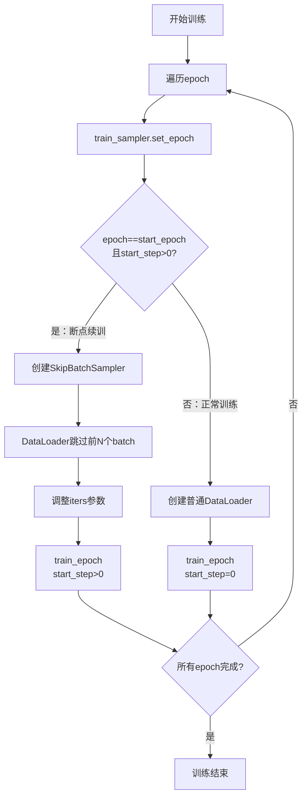

# 11 - 训练循环主流程详解

## 一、模块概述

在 `train_full_sft.py` 的第172-187行，程序启动训练循环：

```python
# Line 172-187
# ========== 8. 开始训练 ==========
for epoch in range(start_epoch, args.epochs):
    train_sampler and train_sampler.set_epoch(epoch)
    if epoch == start_epoch and start_step > 0:  # 断点续训
        batch_sampler = SkipBatchSampler(train_sampler or range(len(train_ds)), 
                                         args.batch_size, start_step + 1)
        loader = DataLoader(train_ds, batch_sampler=batch_sampler, 
                           num_workers=args.num_workers, pin_memory=True)
        Logger(f'Epoch [{epoch + 1}/{args.epochs}]: 跳过前{start_step}个step，从step {start_step + 1}开始')
        train_epoch(epoch, loader, len(loader) + start_step + 1, start_step, wandb)
    else:  # 正常训练
        loader = DataLoader(train_ds, batch_size=args.batch_size, 
                           shuffle=(train_sampler is None), sampler=train_sampler, 
                           num_workers=args.num_workers, pin_memory=True)
        train_epoch(epoch, loader, len(loader), 0, wandb)
```

**核心功能：**
1. 遍历每个epoch
2. 更新采样器epoch（改变shuffle顺序）
3. 断点续训时跳过已训练的batch
4. 调用 `train_epoch()` 执行具体训练

---

## 二、Epoch循环详解

### 2.1 基本结构

```python
# Line 177
for epoch in range(start_epoch, args.epochs):
```

**参数说明：**

| 参数 | 来源 | 说明 |
|------|------|------|
| **start_epoch** | 检查点或0 | 起始epoch（续训时>0） |
| **args.epochs** | 命令行参数 | 总epoch数 |

**示例：**
```python
# 正常训练
start_epoch = 0
args.epochs = 2
range(0, 2)  # [0, 1]

# 断点续训（从epoch 1继续）
start_epoch = 1
args.epochs = 2
range(1, 2)  # [1]
```

---

### 2.2 更新采样器epoch

```python
# Line 178
train_sampler and train_sampler.set_epoch(epoch)
```

**作用：** 确保每个epoch的数据shuffle顺序不同

**原理（已在文档09讲解）：**
```python
# DistributedSampler内部
def set_epoch(self, epoch):
    self.epoch = epoch
    
def __iter__(self):
    g = torch.Generator()
    g.manual_seed(self.epoch)  # 使用epoch作为种子
    indices = torch.randperm(len(self.dataset), generator=g).tolist()
    ...
```

**为什么使用 `and`？**
```python
# 短路求值：如果train_sampler为None，不调用set_epoch
# 单GPU: train_sampler = None → 不执行
# 多GPU: train_sampler = DistributedSampler → 执行set_epoch
```

---

## 三、断点续训逻辑

### 3.1 判断条件

```python
# Line 179
if epoch == start_epoch and start_step > 0:
```

**两个条件：**

| 条件 | 说明 |
|------|------|
| **epoch == start_epoch** | 是恢复后的第一个epoch |
| **start_step > 0** | 存在已训练的step |

**场景分析：**

```python
# 场景1：正常训练
start_epoch = 0, start_step = 0
epoch = 0: (0 == 0) and (0 > 0) → False → 正常训练
epoch = 1: (1 == 0) and (0 > 0) → False → 正常训练

# 场景2：断点续训（epoch 1, step 300继续）
start_epoch = 1, start_step = 300
epoch = 1: (1 == 1) and (300 > 0) → True → 跳过前300步
epoch = 2: (2 == 1) and (300 > 0) → False → 正常训练

# 场景3：epoch结束后续训
start_epoch = 1, start_step = 0
epoch = 1: (1 == 1) and (0 > 0) → False → 正常训练
```

---

### 3.2 SkipBatchSampler（跳过已训练batch）

```python
# Line 180-181
batch_sampler = SkipBatchSampler(
    train_sampler or range(len(train_ds)), 
    args.batch_size, 
    start_step + 1
)
loader = DataLoader(train_ds, batch_sampler=batch_sampler, 
                   num_workers=args.num_workers, pin_memory=True)
```

**SkipBatchSampler 源码回顾（trainer_utils.py）：**

```python
class SkipBatchSampler(Sampler):
    def __init__(self, sampler, batch_size, skip_batches=0):
        self.sampler = sampler
        self.batch_size = batch_size
        self.skip_batches = skip_batches
    
    def __iter__(self):
        batch = []
        skipped = 0
        for idx in self.sampler:
            batch.append(idx)
            if len(batch) == self.batch_size:
                if skipped < self.skip_batches:
                    skipped += 1
                    batch = []
                    continue  # 跳过这个batch
                yield batch
                batch = []
        if len(batch) > 0 and skipped >= self.skip_batches:
            yield batch
```

**工作原理：**

```python
# 假设：start_step = 300
skip_batches = 300 + 1 = 301

# batch 0: 跳过（skipped=1）
# batch 1: 跳过（skipped=2）
# ...
# batch 300: 跳过（skipped=301）
# batch 301: 返回 ✅（从这里开始训练）
# batch 302: 返回 ✅
```

**为什么是 `start_step + 1`？**

```python
# start_step = 300 表示第300步已完成
# 需要从第301步开始
# 因此跳过前301个batch（0-300）
```

---

### 3.3 调整 iters 参数

```python
# Line 183
train_epoch(epoch, loader, len(loader) + start_step + 1, start_step, wandb)
```

**iters 参数：**
```python
iters = len(loader) + start_step + 1
```

**为什么这样计算？**

```python
# 正常epoch: iters = len(loader) = 500（总batch数）
# 断点续训: 
#   - 已跳过：301个batch
#   - 剩余：500 - 301 = 199个batch
#   - len(loader) = 199（SkipBatchSampler返回的长度）
#   - iters = 199 + 300 + 1 = 500（保持与正常训练一致）

# 用于学习率调度：
lr = get_lr(epoch * iters + step, total_steps, lr_initial)
# 需要正确的iters才能保证学习率连续
```

---

## 四、正常训练逻辑

### 4.1 创建DataLoader

```python
# Line 185-186
loader = DataLoader(
    train_ds,
    batch_size=args.batch_size,
    shuffle=(train_sampler is None),  # 单GPU时shuffle
    sampler=train_sampler,             # 多GPU时使用sampler
    num_workers=args.num_workers,
    pin_memory=True
)
```

**DataLoader 参数详解：**

| 参数 | 值 | 说明 |
|------|-----|------|
| **dataset** | train_ds | SFTDataset实例 |
| **batch_size** | 16（默认） | 每个batch的样本数 |
| **shuffle** | True/False | 单GPU时True，多GPU时False |
| **sampler** | DistributedSampler/None | 多GPU时使用，单GPU为None |
| **num_workers** | 1（默认） | 数据加载线程数 |
| **pin_memory** | True | 使用锁页内存（加速GPU传输） |

**num_workers 影响：**

```python
# num_workers=0: 主进程加载数据（慢）
# num_workers=1: 1个子进程加载数据
# num_workers=4: 4个子进程并行加载（快，但占用更多CPU）

# 建议：
# - CPU强：num_workers=4-8
# - CPU弱：num_workers=1-2
```

**pin_memory详解：**

```python
# pin_memory=False: 普通内存 → GPU（约400 MB/s）
# pin_memory=True:  锁页内存 → GPU（约12 GB/s，快30倍）

# 原理：
# 锁页内存（Pinned Memory）不会被操作系统交换到磁盘
# GPU可以通过DMA直接访问，无需CPU拷贝
```

---

### 4.2 调用train_epoch

```python
# Line 186
train_epoch(epoch, loader, len(loader), 0, wandb)
```

**参数说明：**

| 参数 | 值 | 说明 |
|------|-----|------|
| **epoch** | 当前epoch | 0, 1, ... |
| **loader** | DataLoader | 迭代器 |
| **iters** | len(loader) | 总batch数 |
| **start_step** | 0 | 从第0步开始 |
| **wandb** | wandb实例/None | 日志系统 |

---

## 五、完整流程图



---

## 六、train_epoch()函数概览

### 6.1 函数签名

```python
# Line 23
def train_epoch(epoch, loader, iters, start_step=0, wandb=None):
```

**函数职责：**
1. 遍历DataLoader，获取每个batch
2. 前向传播，计算loss
3. 反向传播，计算梯度
4. 更新参数
5. 打印日志
6. 保存检查点

---

### 6.2 核心流程

```python
# Line 24-25
loss_fct = nn.CrossEntropyLoss(reduction='none')
start_time = time.time()

# Line 26
for step, (X, Y, loss_mask) in enumerate(loader, start=start_step + 1):
    # 1. 数据移到GPU（Line 27-29）
    X = X.to(args.device)
    Y = Y.to(args.device)
    loss_mask = loss_mask.to(args.device)
    
    # 2. 动态调整学习率（Line 30-32）
    lr = get_lr(epoch * iters + step, args.epochs * iters, args.learning_rate)
    for param_group in optimizer.param_groups:
        param_group['lr'] = lr
    
    # 3. 前向传播（Line 34-43）
    with autocast_ctx:
        res = model(X)
        loss = ...
    
    # 4. 反向传播（Line 45）
    scaler.scale(loss).backward()
    
    # 5. 梯度累积后更新（Line 47-55）
    if (step + 1) % args.accumulation_steps == 0:
        scaler.step(optimizer)
        optimizer.zero_grad()
    
    # 6. 打印日志（Line 57-65）
    if step % args.log_interval == 0:
        Logger(...)
        wandb.log(...)
    
    # 7. 保存检查点（Line 67-80）
    if step % args.save_interval == 0:
        torch.save(...)
        lm_checkpoint(...)
```

---

## 七、实际训练示例

### 7.1 正常训练（2个epoch）

**命令：**
```bash
torchrun --nproc_per_node 2 train_full_sft.py --epochs 2 --batch_size 16
```

**执行流程：**
```python
# Epoch 0
train_sampler.set_epoch(0)
loader = DataLoader(...)  # batch_size=16, 500个batch
train_epoch(0, loader, 500, 0, wandb)
# → 训练500步 (step 1-500)

# Epoch 1
train_sampler.set_epoch(1)  # 改变shuffle顺序
loader = DataLoader(...)  # batch_size=16, 500个batch
train_epoch(1, loader, 500, 0, wandb)
# → 训练500步 (step 1-500)

# 总训练步数：1000步
```

---

### 7.2 断点续训（从epoch 1, step 300继续）

**命令：**
```bash
torchrun --nproc_per_node 2 train_full_sft.py --epochs 2 --from_resume 1
```

**执行流程：**
```python
# 加载检查点
start_epoch = 1
start_step = 300

# Epoch 1（续训）
train_sampler.set_epoch(1)
batch_sampler = SkipBatchSampler(..., skip_batches=301)
loader = DataLoader(..., batch_sampler=batch_sampler)
# loader长度：500 - 301 = 199

train_epoch(1, loader, 500, 300, wandb)
# → 从step 301开始训练，到step 500
# → 训练200步（301-500）

# Epoch 2（正常）
train_sampler.set_epoch(2)
loader = DataLoader(...)  # batch_size=16, 500个batch
train_epoch(2, loader, 500, 0, wandb)
# → 训练500步 (step 1-500)

# 总续训步数：200 + 500 = 700步
```

---

## 八、常见问题

### Q1: 断点续训后loss突然变化？

**原因：**
```python
# 问题：恢复后从不同的数据开始训练
# epoch 1, step 300已经训练过的数据不会再训练
# 从step 301开始，数据可能难度不同

# 解决：
# 1. 这是正常的，loss会逐渐恢复
# 2. 确保set_epoch(epoch)正确调用，保证数据顺序一致
```

---

### Q2: 如何调整数据加载速度？

**优化方案：**

```python
# 1. 增加num_workers
loader = DataLoader(..., num_workers=4)  # 4个进程并行加载

# 2. 使用pin_memory
loader = DataLoader(..., pin_memory=True)  # 加速GPU传输

# 3. 预取（PyTorch自动）
loader = DataLoader(..., prefetch_factor=2)  # 每个worker预取2个batch

# 4. 持久化worker
loader = DataLoader(..., persistent_workers=True)  # worker不销毁
```

**性能对比：**
```
num_workers=0: 100 batch/s
num_workers=1: 180 batch/s
num_workers=4: 350 batch/s（CPU足够时）
```

---

### Q3: SkipBatchSampler会影响数据顺序吗？

**回答：**

```python
# 不会！shuffle在SkipBatchSampler之前完成

# 流程：
1. train_sampler.set_epoch(epoch)  # 生成shuffle后的索引
2. SkipBatchSampler(train_sampler, ...)  # 使用已shuffle的索引
3. 跳过前N个batch，剩余batch保持原有顺序

# 因此：
# - 数据仍然是shuffle的
# - 只是跳过了前面的batch
# - 续训和正常训练看到相同的数据顺序
```

---

## 九、知识点总结

### 核心概念

| 概念 | 说明 |
|------|------|
| **Epoch** | 遍历整个数据集一次 |
| **SkipBatchSampler** | 跳过前N个batch，用于断点续训 |
| **pin_memory** | 锁页内存，加速CPU→GPU传输 |
| **num_workers** | 数据加载线程数 |
| **start_step** | 起始step，续训时>0 |

### 关键代码

```python
# Epoch循环
for epoch in range(start_epoch, args.epochs):
    train_sampler and train_sampler.set_epoch(epoch)
    
    # 断点续训
    if epoch == start_epoch and start_step > 0:
        batch_sampler = SkipBatchSampler(..., start_step + 1)
        loader = DataLoader(..., batch_sampler=batch_sampler)
        train_epoch(epoch, loader, len(loader) + start_step + 1, start_step, wandb)
    # 正常训练
    else:
        loader = DataLoader(..., batch_size=batch_size, sampler=train_sampler)
        train_epoch(epoch, loader, len(loader), 0, wandb)
```

---

## 十、下一步学习内容

在下一节中，我们将深入分析 **train_epoch()函数的核心逻辑**：

1. **前向传播与损失计算**
   - 模型前向传播
   - CrossEntropyLoss详解
   - loss mask应用
   - 梯度累积

2. **反向传播与参数更新**
   - 反向传播流程
   - 梯度裁剪
   - 优化器更新
   - 学习率调度

---

**状态：** ✅ 已完成训练循环主流程分析
