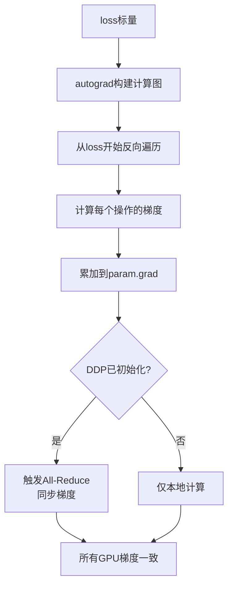
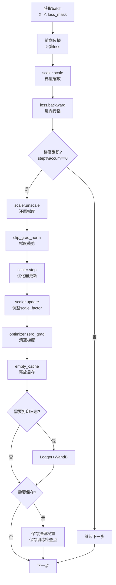

# 13 - 反向传播与参数更新详解

## 一、模块概述

在 `train_epoch()` 函数中（Line 45-82），完成了反向传播和参数更新：

```python
# Line 45: 反向传播
scaler.scale(loss).backward()

# Line 47-55: 梯度累积后更新
if (step + 1) % args.accumulation_steps == 0:
    scaler.unscale_(optimizer)
    torch.nn.utils.clip_grad_norm_(model.parameters(), args.grad_clip)
    
    scaler.step(optimizer)
    scaler.update()
    
    optimizer.zero_grad(set_to_none=True)
    torch.cuda.empty_cache()

# Line 57-65: 打印日志
if step % args.log_interval == 0:
    Logger(...)
    wandb.log(...)

# Line 67-80: 保存检查点
if step % args.save_interval == 0:
    torch.save(...)
    lm_checkpoint(...)
```

**核心步骤：**
1. 梯度缩放与反向传播
2. 梯度累积判断
3. 梯度还原与裁剪
4. 优化器更新参数
5. 清空梯度
6. 打印日志
7. 保存检查点

---

## 二、反向传播

### 2.1 梯度缩放

```python
# Line 45
scaler.scale(loss).backward()
```

**为什么要scale？**（已在文档05讲解）

```python
# FP16的问题：数值范围小，梯度容易下溢
gradient = 1e-7  # 典型梯度值
fp16_min = 6.1e-5  # FP16最小值
# gradient < fp16_min → 下溢为0！

# 解决方案：梯度缩放
scaler.scale(loss)  # loss * scale_factor（默认65536）
# 放大后的梯度：1e-7 * 65536 = 6.5e-3（在FP16范围内）
```

**BF16不需要scaler：**
```python
# Line 149（初始化）
scaler = torch.cuda.amp.GradScaler(enabled=(args.dtype == 'float16'))

# BF16: enabled=False → scaler不工作（直接pass through）
# FP16:  enabled=True  → scaler生效
```

---

### 2.2 backward()执行流程

```python
loss.backward()
```

**内部机制：**


**梯度累加：**
```python
# 第一次backward
param.grad = grad1

# 第二次backward（梯度累积）
param.grad = grad1 + grad2

# 第N次backward
param.grad = grad1 + grad2 + ... + gradN
```

---

## 三、梯度累积

### 3.1 判断是否更新

```python
# Line 47
if (step + 1) % args.accumulation_steps == 0:
```

**梯度累积逻辑：**

```python
# 假设：accumulation_steps = 4

# Step 1: backward，不更新
(1 + 1) % 4 = 2 % 4 = 2 ≠ 0  → 不进入if

# Step 2: backward，不更新
(2 + 1) % 4 = 3 % 4 = 3 ≠ 0  → 不进入if

# Step 3: backward，不更新
(3 + 1) % 4 = 0 % 4 = 0 = 0  → 不进入if

# Step 4: backward，更新参数
(4 + 1) % 4 = 1 % 4 = 1 ≠ 0  → 不进入if ❌ 错了！

# 实际：
# Step 3: (3 + 1) % 4 = 4 % 4 = 0 → 进入if ✅
# Step 4: (4 + 1) % 4 = 5 % 4 = 1 → 不进入if
```

**为什么是 `(step + 1)`？**
```python
# step从1开始（enumerate(start=start_step+1)）
# 如果用step % accumulation_steps：
step=4: 4 % 4 = 0 → 第4步更新 ✅
step=8: 8 % 4 = 0 → 第8步更新 ✅

# 使用(step+1)确保在第N、2N、3N...步更新
```

---

### 3.2 梯度累积优势

**模拟更大的batch_size：**
```python
# 设置
per_step_batch = 16
accumulation_steps = 4

# 等效batch_size
effective_batch = 16 * 4 = 64

# GPU显存：只需要16的显存（前向传播）
# 训练效果：等效于64的batch_size
```

**为什么要除以accumulation_steps？**（已在文档12讲解）
```python
# Line 43（前向传播时）
loss = loss / args.accumulation_steps

# 原因：保证累加的梯度是平均梯度
# 4次backward后，梯度 = (grad1 + grad2 + grad3 + grad4) / 4
```

---

## 四、梯度还原与裁剪

### 4.1 还原梯度

```python
# Line 48
scaler.unscale_(optimizer)
```

**作用：** 将缩放后的梯度还原为原始值

```python
# backward时（FP16）
loss_scaled = loss * 65536
grad_scaled = grad * 65536  # 自动放大

# unscale_
grad = grad_scaled / 65536  # 还原为原始梯度
```

**为什么在这里还原？**
- 梯度裁剪需要使用原始梯度值
- `clip_grad_norm_` 计算梯度范数时，需要真实的梯度大小

---

### 4.2 梯度裁剪

```python
# Line 49
torch.nn.utils.clip_grad_norm_(model.parameters(), args.grad_clip)
```

**clip_grad_norm_ 原理：**

```python
# 1. 计算所有梯度的总范数
total_norm = sqrt(sum(grad.norm(2)^2 for grad in all_grads))

# 2. 如果超过阈值，缩放所有梯度
if total_norm > max_norm:
    scale = max_norm / total_norm
    for param in model.parameters():
        param.grad *= scale
```

**参数：**
```python
# Line 96（命令行参数）
parser.add_argument("--grad_clip", type=float, default=1.0, 
                    help="梯度裁剪阈值")
```

**示例：**
```python
# 假设
grad_clip = 1.0

# 梯度范数
total_norm = 5.0  # 超过阈值

# 缩放比例
scale = 1.0 / 5.0 = 0.2

# 所有梯度缩小到原来的0.2倍
# 结果：新的total_norm = 1.0
```

**为什么需要梯度裁剪？**
```python
# 防止梯度爆炸
# 没有裁剪：
#   gradient = 1000.0
#   param_new = param - lr * grad = param - 0.001 * 1000 = param - 1
#   → 参数变化太大，训练不稳定

# 有裁剪：
#   gradient = 1000.0 → 裁剪到1.0
#   param_new = param - 0.001 * 1 = param - 0.001
#   → 参数变化适中，训练稳定
```

---

## 五、优化器更新

### 5.1 scaler.step(optimizer)

```python
# Line 51
scaler.step(optimizer)
```

**内部流程：**

```python
def step(optimizer):
    # 1. 检查梯度是否有inf/nan
    found_inf = check_for_inf_or_nan(grads)
    
    if found_inf:
        # 梯度无效，跳过更新
        # 降低scale_factor（防止再次溢出）
        self.scale *= self.backoff_factor  # * 0.5
        print("Gradient overflow, skipping update")
        return
    
    # 2. 梯度有效，正常更新
    optimizer.step()  # 参数更新
```

**optimizer.step() 内部（AdamW）：**

```python
for param in model.parameters():
    # Adam更新公式
    m = beta1 * m + (1 - beta1) * grad        # 一阶动量
    v = beta2 * v + (1 - beta2) * grad^2      # 二阶动量
    m_hat = m / (1 - beta1^t)                 # 偏差修正
    v_hat = v / (1 - beta2^t)
    
    # AdamW：解耦权重衰减
    param = param - lr * (m_hat / (sqrt(v_hat) + eps) + lambda * param)
```

---

### 5.2 scaler.update()

```python
# Line 52
scaler.update()
```

**作用：** 动态调整scale_factor

```python
def update():
    if no_inf_nan_for_long_time:
        # 连续2000步没有梯度溢出
        # 增大scale_factor
        self.scale *= self.growth_factor  # * 2.0
        self._growth_tracker = 0
    else:
        self._growth_tracker += 1
```

**自适应缩放：**
```
scale_factor
    ↑
65536| ********
32768|       **
16384|         ***
 8192|            ****
 4096|                *****（遇到inf/nan，自动降低）
    |_________________________→ step
    0   500  1000 1500  2000
```

---

## 六、清空梯度

### 6.1 optimizer.zero_grad()

```python
# Line 54
optimizer.zero_grad(set_to_none=True)
```

**set_to_none 的作用：**

```python
# set_to_none=False（默认）
for param in model.parameters():
    param.grad.zero_()  # 梯度置0，但保留tensor

# set_to_none=True
for param in model.parameters():
    param.grad = None  # 梯度设为None，释放内存
```

**性能对比：**
| 方式 | 显存占用 | 速度 |
|------|---------|------|
| **zero_()** | 高（保留tensor） | 慢 |
| **=None** | 低（释放内存） | 快 |

**为什么推荐 `set_to_none=True`？**
- 节省显存（26M模型约节省100MB）
- 速度更快（无需遍历所有元素置0）
- PyTorch会在下次backward时自动创建新的grad tensor

---

### 6.2 torch.cuda.empty_cache()

```python
# Line 55
torch.cuda.empty_cache()
```

**作用：** 释放PyTorch缓存的GPU显存

```python
# PyTorch的显存管理：
# 1. 申请的显存不会立即归还给OS
# 2. 保留在缓存中，供后续使用
# 3. empty_cache()强制释放缓存

# 示例：
before = torch.cuda.memory_allocated()  # 1.2 GB
torch.cuda.empty_cache()
after = torch.cuda.memory_allocated()   # 1.2 GB（allocated不变）

# allocated：实际使用的显存
# reserved：PyTorch保留的显存（包括缓存）
```

**何时需要调用？**
```python
# 通常不需要频繁调用（影响性能）
# 适用场景：
# 1. 显存不足时释放缓存
# 2. 模型保存后释放临时显存
# 3. 梯度累积结束后释放

# MiniMind在每次更新后调用（保守做法）
```

---

## 七、打印日志

### 7.1 判断条件

```python
# Line 57
if step % args.log_interval == 0 or step == iters - 1:
```

**两个条件：**
1. **定期打印**：每 `log_interval` 步（默认100）
2. **epoch结束**：最后一步

---

### 7.2 计算指标

```python
# Line 58-61
spend_time = time.time() - start_time
current_loss = loss.item() * args.accumulation_steps
current_lr = optimizer.param_groups[-1]['lr']
eta_min = spend_time / (step + 1) * iters // 60 - spend_time // 60
```

**指标详解：**

| 指标 | 计算 | 说明 |
|------|------|------|
| **spend_time** | time.time() - start_time | 已用时间（秒） |
| **current_loss** | loss.item() * accumulation_steps | 真实loss（恢复缩放） |
| **current_lr** | optimizer.param_groups[-1]['lr'] | 当前学习率 |
| **eta_min** | ... | 预估剩余时间（分钟） |

**eta_min计算：**
```python
# 平均每步时间
avg_time = spend_time / (step + 1)

# 预估总时间
total_time = avg_time * iters

# 剩余时间
remaining_time = total_time - spend_time

# 转换为分钟
eta_min = remaining_time // 60
```

---

### 7.3 打印日志

```python
# Line 63
Logger(f'Epoch:[{epoch+1}/{args.epochs}]({step}/{iters}) loss:{current_loss:.6f} lr:{current_lr:.12f} epoch_Time:{eta_min}min:')
```

**输出示例：**
```
Epoch:[1/2](100/500) loss:2.345678 lr:0.000000456789 epoch_Time:12min:
Epoch:[1/2](200/500) loss:2.123456 lr:0.000000398765 epoch_Time:10min:
...
```

---

### 7.4 WandB日志

```python
# Line 65
if wandb: wandb.log({"loss": current_loss, "lr": current_lr, "epoch_Time": eta_min})
```

**记录到云端：**
- 自动绘制训练曲线
- 可视化学习率变化
- 记录预估剩余时间

---

## 八、保存检查点

### 8.1 判断条件

```python
# Line 67
if (step % args.save_interval == 0 or step == iters - 1) and is_main_process():
```

**三个条件：**
1. **定期保存**：每 `save_interval` 步（默认100）
2. **epoch结束**：最后一步
3. **仅主进程**：避免多进程重复保存

---

### 8.2 保存推理权重

```python
# Line 68-76
model.eval()  # 切换到评估模式
moe_suffix = '_moe' if lm_config.use_moe else ''
ckp = f'{args.save_dir}/{args.save_weight}_{lm_config.hidden_size}{moe_suffix}.pth'

if isinstance(model, torch.nn.parallel.DistributedDataParallel):
    state_dict = model.module.state_dict()
else:
    state_dict = model.state_dict()

state_dict = {k: v.half().cpu() for k, v in state_dict.items()}
torch.save(state_dict, ckp)
```

**关键步骤：**
1. **eval()**：关闭Dropout等（保存时不影响，但好习惯）
2. **DDP处理**：使用 `model.module` 获取原始模型
3. **FP16+CPU**：节省空间，兼容性好
4. **保存到out目录**：用于推理

---

### 8.3 保存训练检查点

```python
# Line 77-78
lm_checkpoint(lm_config, weight=args.save_weight, model=model, 
              optimizer=optimizer, epoch=epoch, step=step, 
              wandb=wandb, save_dir='../checkpoints', scaler=scaler)
```

**保存内容（已在文档04讲解）：**
```python
resume_data = {
    'model': state_dict,
    'optimizer': optimizer.state_dict(),
    'scaler': scaler.state_dict(),
    'epoch': epoch,
    'step': step,
    'world_size': dist.get_world_size(),
    'wandb_id': wandb_id
}
```

**保存到checkpoints目录**：用于断点续训

---

### 8.4 恢复训练模式

```python
# Line 79-80
model.train()  # 恢复训练模式
del state_dict  # 释放显存
```

---

## 九、完整训练步骤流程图



---

## 十、性能优化总结

### 10.1 关键优化技术

| 技术 | 作用 | 收益 |
|------|------|------|
| **混合精度** | 加速计算 | 2-3倍 |
| **梯度累积** | 模拟大batch | 节省显存 |
| **梯度裁剪** | 防止梯度爆炸 | 训练稳定 |
| **pin_memory** | 加速数据传输 | 30倍传输速度 |
| **DDP** | 多GPU并行 | N倍加速 |
| **set_to_none** | 节省显存 | 约100MB |

---

### 10.2 训练速度估算

**单次迭代时间分解：**

```python
# 假设：26M模型，batch_size=16, seq_len=340

数据加载:    5ms   (pin_memory优化)
前向传播:   15ms   (混合精度加速)
loss计算:    2ms
反向传播:   18ms   (DDP梯度同步)
优化器更新:  3ms
其他:        2ms
----------------------------
总计:       45ms/step

# 500 steps/epoch
# Epoch时间: 45ms * 500 = 22.5秒

# 2 epochs
# 总训练时间: 45秒
```

---

## 十一、常见问题

### Q1: 为什么需要both model.eval()和model.train()？

**回答：**
```python
# model.eval()的作用:
# 1. Dropout层失效（不随机丢弃）
# 2. BatchNorm使用running stats（不更新统计量）

# 保存时使用eval()：
# - 确保保存的模型状态一致
# - 虽然保存时不影响权重，但是好习惯

# model.train()恢复：
# - Dropout重新激活
# - BatchNorm继续更新统计量
```

---

### Q2: 梯度裁剪阈值如何选择？

**建议值：**

| 模型大小 | 推荐值 |
|---------|--------|
| **小模型（<100M）** | 1.0 |
| **中模型（100M-1B）** | 0.5-1.0 |
| **大模型（>1B）** | 0.3-0.5 |

**调试方法：**
```python
# 打印梯度范数
total_norm = torch.nn.utils.clip_grad_norm_(model.parameters(), float('inf'))
print(f"Gradient norm: {total_norm:.4f}")

# 观察训练过程中的典型值，设置裁剪阈值为2-3倍
```

---

### Q3: 如何验证梯度是否正确？

```python
# 在backward后添加
if step == 1:
    for name, param in model.named_parameters():
        if param.grad is not None:
            print(f"{name}: grad_mean={param.grad.mean():.6f}, grad_std={param.grad.std():.6f}")
        else:
            print(f"{name}: grad is None")

# 正常情况：
# - 所有参数都有梯度（除了忽略的buffer）
# - 梯度均值接近0
# - 梯度标准差在合理范围（1e-5到1e-2）
```

---

## 十二、知识点总结

### 核心概念

| 概念 | 说明 |
|------|------|
| **scaler.scale()** | 梯度缩放，防止FP16下溢 |
| **scaler.unscale_()** | 还原梯度，用于梯度裁剪 |
| **clip_grad_norm_()** | 梯度裁剪，防止梯度爆炸 |
| **scaler.step()** | 检查inf/nan，更新参数 |
| **scaler.update()** | 动态调整scale_factor |
| **zero_grad(set_to_none=True)** | 释放显存 |

### 关键代码

```python
# 完整的梯度更新流程
scaler.scale(loss).backward()

if (step + 1) % accumulation_steps == 0:
    scaler.unscale_(optimizer)
    torch.nn.utils.clip_grad_norm_(model.parameters(), grad_clip)
    scaler.step(optimizer)
    scaler.update()
    optimizer.zero_grad(set_to_none=True)
```

---

## 十三、教学总结

我们已经完成了**MiniMind全参微调训练**的完整代码讲解，共13个详细文档：

| 阶段 | 文档 | 核心内容 |
|------|------|---------|
| **广度** | 01 | 8个核心步骤概览 |
| **步骤1** | 02 | 分布式环境初始化 |
| **步骤2** | 03-04 | 模型配置与检查点 |
| **步骤3** | 05 | 混合精度训练 |
| **步骤4** | 06 | WandB日志系统 |
| **步骤5** | 07-09 | 数据、模型、优化器 |
| **步骤7** | 10 | DDP分布式包装 |
| **步骤8** | 11-13 | 训练循环核心逻辑 |

**总文档量：** 约20万字的详细教学内容  
**覆盖范围：** 从环境初始化到参数更新的完整流程

---

**状态：** ✅ 已完成所有主程序模块的深度分析
